<p align="center">
  
</p>

<h1 align="center">Chess by Committee</h1>
<p align="center"><em>A methodology-driven experimental framework for AI-generated chess engines</em></p>

<p align="center">
  <a href="https://github.com/jeffreyzhou-harvard/PointChessEngine/stargazers">
    
  </a>
  <a href="https://github.com/jeffreyzhou-harvard/PointChessEngine/network/members">
    
  </a>
  <a href="https://github.com/jeffreyzhou-harvard/PointChessEngine/actions/workflows/tests.yml">
    
  </a>
  
</p>

We did not build a single chess engine.
We built a structured experimental apparatus for generating and comparing chess engines under different AI methodologies, then measured the methodologies themselves.

---

## Overview

This repository investigates a core research question:

**How do different meta-prompting methods (one-shot, contextualized one-shot, chain-of-thought, ReAct, recursive-LM decomposition) and agentic development frameworks (LangGraph specialist orchestration, multi-model judge-mediated debate, multi-model peer-vote ensembles) affect the resulting chess engine's playing strength, search efficiency, build cost, and runtime behavior?**

The chess engine artifact is the *unit of measurement* — not the endpoint. The endpoint is a controlled comparison along several axes that are usually conflated:

- **meta-prompting method** — one prompt vs. [chain-of-thought](https://arxiv.org/abs/2201.11903) vs. [ReAct](https://arxiv.org/abs/2210.03629) vs. recursive decomposition
- **agentic framework** — none vs. [LangGraph](https://www.langchain.com/langgraph) specialists vs. multi-model debate vs. peer-vote ensemble
- **decision rule** — single judge vs. plurality vote vs. per-role specialist
- **model mix** — single-provider (Claude) vs. multi-provider (OpenAI / Grok / Gemini / DeepSeek / Kimi / Claude)
- **parallelization strategy** — within-process / game-level / matrix-level

Each of the eight engines holds the *task* constant (build a complete [UCI](https://www.chessprogramming.org/UCI) chess engine satisfying the same brief) and varies one or more of these axes. Every engine is then graded on the same multi-axis scorecard:

- **playing strength** — head-to-head results in `arena/`, contract-test pass rate, classical-milestone score
- **search efficiency** — depth reached, nodes searched, NPS, eval quality per move
- **runtime cost** — wall time per move, cumulative game time
- **build cost** — total $ spent, total tokens, lines of code produced, build wall time
- **robustness** — illegal-move rate, UCI-compliance failures, crash/timeout behavior

---

## Our initial hypothesis

Going in, we expected that **the more an agent is forced to plan and reason about its own design choices before writing code, the higher-quality and more thoroughly built-out the resulting engine would be** — measured both as playing strength and as raw lines of code shipped. Concretely:

- **One-shot baselines** would underperform because the model commits to a design implicitly, never surfaces tradeoffs, and runs out of attention before fleshing out the harder modules (search extensions, ELO scaling, edge cases in legality).
- **Chain-of-thought and ReAct** would do better because the model is forced to think through the design before (or during) writing it — surfacing more tradeoffs, catching more edge cases, producing more code per topic.
- **Agentic frameworks with multiple parallel roles** (LangGraph specialists, multi-model debate, peer-vote ensembles) would be the *extension* of that idea: split the planning across several focused agents, let them critique each other, and let a synthesizer compile the result. More parallel "thinking" → more design coverage → more complete engine.

The project is structured to *test* that hypothesis rather than assume it: every engine implements the same brief under the same constraints (pure Python, stdlib only, full UCI surface, ELO slider 400–2400), and the only thing that varies is the meta-prompting method or agentic framework that produced it. If the hypothesis is right, we should see playing strength and LOC scale roughly with how much pre-implementation reasoning each methodology forces. If it's wrong — if a one-shot prompt with a strong model holds its own against multi-agent orchestration — that's the more interesting finding.

---

## Sneak peek

<p align="center">
  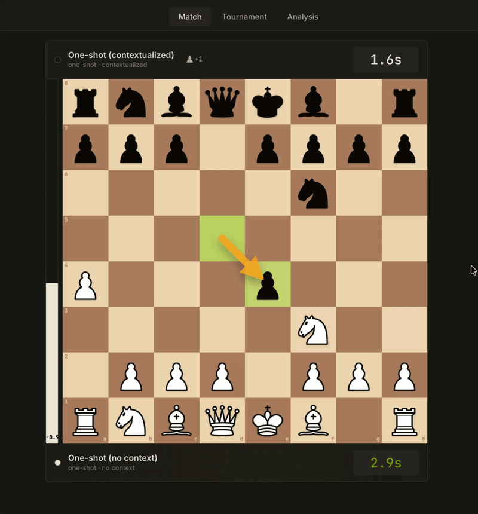
</p>

<p align="center"><em>Two of our final generated engines going head-to-head inside our own tournament software (the <code>arena/</code> web UI).</em></p>

<p align="center">
  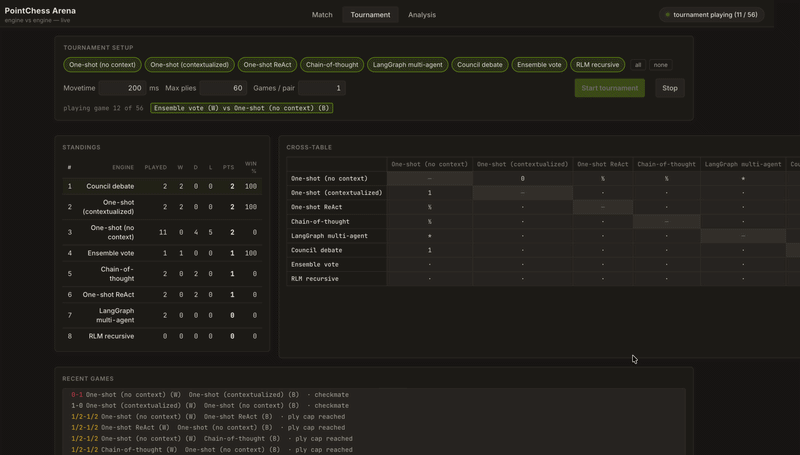
</p>

<p align="center"><em>Tournament mode running for all 8 final generated engines.</em></p>

---

## Why this project matters

Most chess+LLM work reports playing strength from one methodology. That conflates model quality with system design quality.

This project separates those variables. Chess is a clean evaluation domain:

- fixed rules
- strong oracle ([Stockfish](https://stockfishchess.org/))
- well-studied search space
- measurable failure modes (illegal moves, hallucinated board state, protocol errors)

That makes it a practical benchmark for the broader engineering question:

**Given a fixed engineering task, which combination of meta-prompting method + agentic framework + model mix maximizes output quality per dollar — and is the marginal cost of more orchestration ever justified?**

---

## Current repository scope

This repo currently contains multiple concrete engine implementations plus orchestration/testing infrastructure.

### Top-level layout

```
engines/         the chess-engine artifacts being compared (each speaks UCI)
methodologies/   the builders that produce engines (orchestration runtimes)
arena/           web UI for engine-vs-engine matches with live metrics
infra/           configs, scripts, agent/task/orchestrator protocol docs
reports/         run, eval, and comparison artifacts
tests/           cross-engine classical / contract tests
```

### The eight engines and their construction methods

The whole point of the repo is the controlled A/B/C/... across these.
Every engine is a complete, UCI-speaking, pure-Python alpha-beta
chess engine. What changes is **how it was produced.**

| engine                                | construction method                                                | who decided | who wrote the code |
|---------------------------------------|--------------------------------------------------------------------|-------------|--------------------|
| `engines/oneshot_nocontext/`          | one Claude prompt, no project context                              | Claude      | Claude             |
| `engines/oneshot_contextualized/`     | one Claude prompt with curated repo context                        | Claude      | Claude             |
| `engines/oneshot_react/`              | one ReAct-style prompt with tool access                            | Claude      | Claude             |
| `engines/chainofthought/`             | incremental chain-of-thought prompting                             | Claude      | Claude             |
| `engines/langgraph/`                  | LangGraph multi-agent orchestration: per-role specialists          | per-role    | per-role           |
| `engines/debate/`                     | multi-model design *debate* (OpenAI · Grok · Gemini · DeepSeek · Kimi) → Claude judges & builds | Claude (judge) | Claude             |
| `engines/ensemble/`                   | multi-model design *vote* (same advisors, no judge) → Claude builds | plurality   | Claude             |
| `engines/rlm/`                        | Recursive Language Model-inspired decomposition                    | Claude      | Claude             |

<p align="center">
  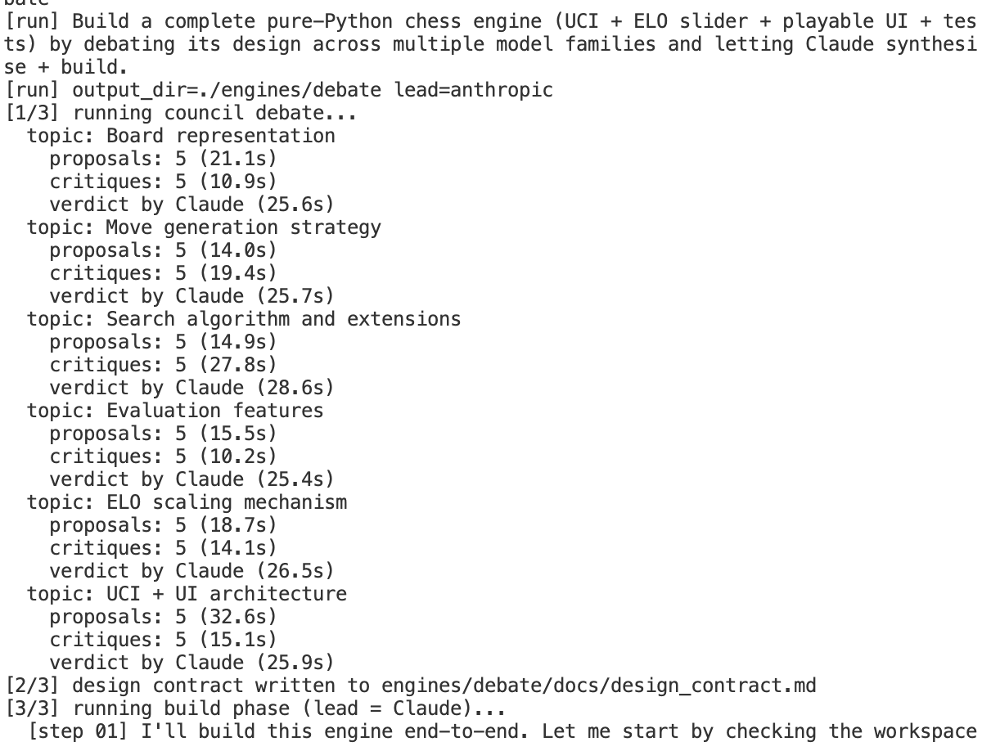
</p>

<p align="center"><em>Observability and chain-of-thought trace for the debate / ensemble architecture.</em></p>

Each engine is registered in `arena/engines.py::REGISTRY`, so adding
a ninth engine is a one-line addition: every cross-engine test, the
arena UI, and the contract suite pick it up automatically.

<p align="center">
  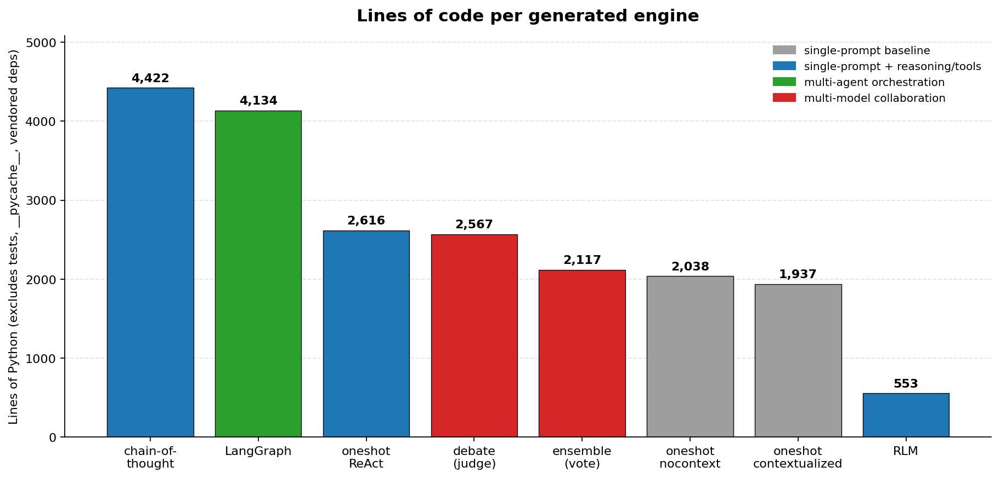
</p>

<p align="center"><em>Lines of Python per generated engine (excludes tests, <code>__pycache__</code>, vendored deps), color-coded by methodology family. Regenerate with <code>python -m infra.scripts.plot_loc --csv</code>.</em></p>

### Methodologies (engine builders)

The build orchestrators that produce each non-trivial engine artifact:

- `methodologies/langgraph/` - LangGraph multi-agent specialists →
  `engines/langgraph/`
- `methodologies/debate/`    - multi-model debate with Claude as judge →
  `engines/debate/`
- `methodologies/ensemble/`  - multi-model voting with no judge →
  `engines/ensemble/`
- `methodologies/rlm/`       - Recursive-LM-style prompting recipe →
  `engines/rlm/`

The four `oneshot_*` and `chainofthought` engines are direct prompt
recipes; their methodology is captured in their own READMEs rather
than in a separate orchestrator module.

### Interactive arena: pit them against each other, see the numbers

`arena/` is a local web UI (`python -m arena` → `http://127.0.0.1:8765`)
that pits any two registered engines against each other in real time
and streams every metric you'd want for the comparison:

| metric                                  | source                                  |
|-----------------------------------------|-----------------------------------------|
| game result (W/D/L) and reason          | [python-chess](https://python-chess.readthedocs.io/) + arena rules |
| per-move depth, nodes, NPS, score (cp / mate) | each engine's `info` UCI line     |
| per-move wall time                      | arena timer around `go`                 |
| cumulative engine clocks                | arena scoreboard                        |
| [chess.com](https://www.chess.com/)-style move arrows + eval bar | arena UI                |
| build cost ($), tokens, model           | `arena/engine_costs.json` (per engine)  |
| lines of code                           | computed by arena from each engine tree |

The arena is the live counterpart to the batch tournament harness in
`infra/scripts/`; both feed the same comparison reports.

For arena-specific details, see `arena/README.md`.

### Evaluation and orchestration assets

- `infra/agents/` - methodology/process protocols and parallelization plans
- `infra/orchestrators/` - orchestration schemas and debate runtime notes
- `infra/scripts/` - candidate scoring, champion tests, report generation
- `infra/tasks/` - work plans and protocol docs
- `reports/` - run/eval/comparison outputs
- `tests/` - classical/contract/dashboard tests

---

## What we measured, and how

Beyond raw playing strength, the comparison hinges on instrumentation. Each engine is wired up to surface five layers of telemetry:

- **Per-move telemetry** — depth, nodes searched, NPS, score (cp/mate), wall-time, captured directly from each engine's UCI `info` lines and the arena's wall-clock around `go`. Streamed live in `arena/` and persisted to JSONL.
- **Build cost telemetry** — `arena/engine_costs.json` carries `build_cost_usd`, `build_tokens`, and `build_model` per engine. The arena UI surfaces them next to playing strength so you can read strength-per-dollar at a glance.
- **Test telemetry** — every engine ships its own `tests/` tree containing **unit tests** (board, move-generation, evaluation), **perft tests** (move-generation correctness against reference counts at depth ≥ 4), and **UCI-protocol tests** (handshake, info-line semantics, lifecycle). Test pass-rate and perft-correctness become first-class metrics in the comparison; the cross-engine `tests/contract/` parameterizes 9 protocol checks over every entry in `arena.engines.REGISTRY`, so any new engine joins the test matrix automatically.
- **Tournament telemetry** — round-robin W/L/D, per-pair scores, Bradley-Terry Elo with bootstrap CIs, color balance, and legal-move rate, captured from the live `arena/` runs and the batch `infra/scripts/` tournament harness.
- **Process telemetry (observability)** — the multi-agent and debate methodologies emit structured traces of each turn (which agent spoke, what they said, judge verdict). Captured via the LangGraph runtime's built-in observability hooks.

---

## Observability via LangGraph

`engines/langgraph/` and `methodologies/langgraph/` are not just *another* engine — they are the project's primary observability surface. LangGraph models every multi-agent build as an explicit graph of typed nodes (specialist roles) and edges (state transitions). That gives us:

- **Replayable traces** — every state transition is dumped as a timestamped record. We can re-run the *same* graph on the *same* input and inspect where decisions branched without re-paying the LLM cost.
- **Per-role attribution** — when a final engine has a bug, we can walk back to the specific specialist node whose output introduced it. Single-prompt baselines can't do this.
- **A/B-able decision rules** — the judge-vs-vote distinction (`methodologies/debate/` vs `methodologies/ensemble/`) is one node-swap in a LangGraph definition. Swapping cost-per-pass dropped from "rebuild the orchestrator" to "edit one edge."

This is also what makes the eight-engine comparison fair: every multi-agent variant emits the same observability schema, so cross-method comparisons are apples-to-apples on **process metrics**, not just outcome metrics. `Promptfoo` (declarative prompt-level test cases) sits alongside this stack as the prompt-side analogue of unit tests — a regression suite that catches the moment a methodology's design-phase prompt stops producing a valid module spec, before any code is generated.

---

## Parallelism via per-task Docker containers

Each engine ships a `docker_parallel_orchestrator/` subtree (see `engines/oneshot_contextualized/docker_parallel_orchestrator/`, `engines/oneshot_nocontext/docker_parallel_orchestrator/`, `engines/chainofthought/docker_parallel_orchestrator/`, and `engines/oneshot_react/docker_parallel_orchestrator/`) that enacts the build DAG as a fleet of isolated Docker containers — one per task — orchestrated by `asyncio` or by `docker compose`'s `service_completed_successfully` dependency mechanism. Each container is functionally a tiny VM: its own filesystem, its own PID 1, no shared state with peers. The orchestrator launches every task whose dependencies have been satisfied and waits only on the longest path through the DAG, so independent tasks (the 6-way fan-out after `C2_LEGAL_MOVES`, the 4-way fan-out at the end) execute concurrently.

The post-run verifier reads each container's self-recorded `start_time` / `end_time` JSON and asserts four invariants: dependencies respected, declared parallel groups overlapped at a common instant, the four final-eval tasks all overlapped pairwise, and every artifact landed on disk. Faking parallelism is hard because the verifier never trusts orchestrator clocks — only the wall times each container recorded for itself. We then ran all four engines' DAGs *concurrently* on a single host (distinct compose project / image names per engine) and confirmed every pair of engines shared a real wall-clock overlap window:

<p align="center">
  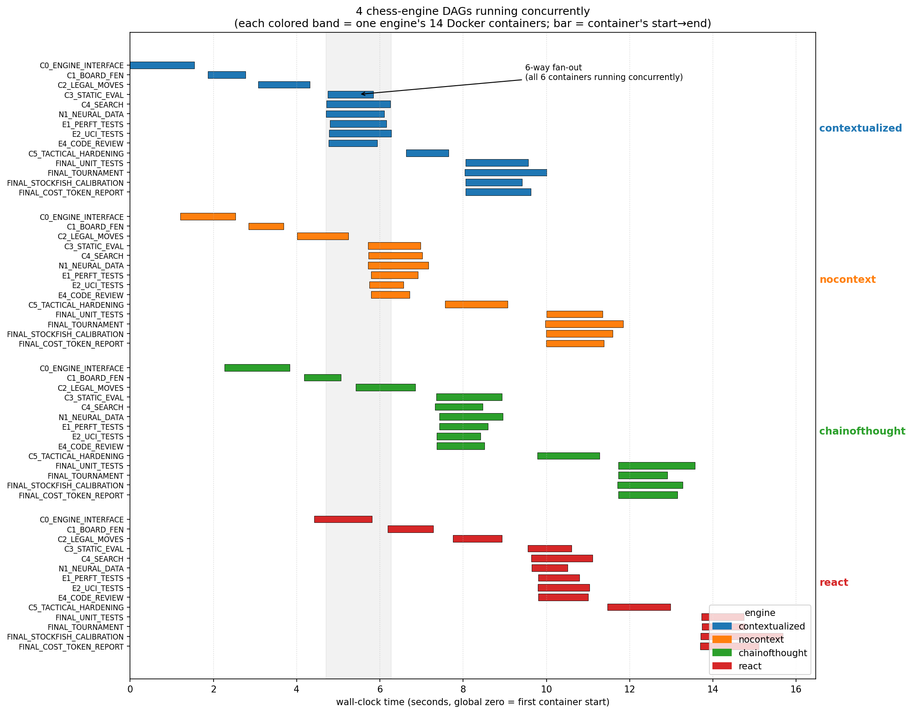
</p>
<p align="center"><em>Four engine DAGs (colored bands) executing simultaneously. Within each band, the 6-way fan-out after <code>C2_LEGAL_MOVES</code> and the 4-way final-eval fan-out are visibly stacked. Across bands, the four engines overlap horizontally — proof that the engines are building at the same wall-clock time, not in sequence.</em></p>

This gives us the cheapest possible local stand-in for the eventual remote-agent-VM setup: when each "engineer" agent is a real VM with its own toolchain, the dispatcher above doesn't change shape — only the executor does.

---

## Research and prior art (deep dive)

Before describing what's in the repo, the section below grounds the project in the recent literature it draws from. Each of the four research streams below mapped onto a concrete piece of the build.

### Recursive Language Models (RLM)

**What it is.** Recursive Language Models, introduced by Alex Zhang and collaborators in [arXiv:2512.24601](https://arxiv.org/abs/2512.24601) and accompanied by the open-source reference implementation at [`alexzhang13/rlm`](https://github.com/alexzhang13/rlm), formalize the idea that a language model's *next answer* can itself be the result of recursive calls into smaller, scoped LM invocations. Instead of a single forward pass on a long context, the model treats parts of its context as opaque pointers and dispatches sub-queries that read those pointers on-demand. Each sub-call returns a compressed answer that the outer call can integrate. The recursion can be arbitrarily deep, with leaf calls handling the most concrete reasoning and the root call doing planning and synthesis.

**Why it matters.** Long-context LLMs run into three well-documented failure modes — middle-of-context attention collapse, quadratic compute, and the impossibility of selectively forgetting. RLM sidesteps all three by making "look at this section of the input" an explicit, scoped operation rather than a passive read. The empirical claim from the paper is that the same total token budget produces strictly better answers when spent recursively rather than monolithically — particularly for tasks that decompose naturally into sub-problems.

**How we used it for chess.** A chess engine decomposes naturally: legality, search, evaluation, tactics, opening, endgame, UCI protocol, ELO calibration. `methodologies/rlm/` implements an RLM-style build by treating each module as a leaf sub-call, with a root call that plans the module list, dispatches the sub-builds, and integrates their outputs into a single coherent engine. Each sub-call sees only the sub-task's spec (not the rest of the engine's source), which mirrors the paper's "scoped read" primitive. The resulting `engines/rlm/` is the only engine in the repo whose build process intentionally never has the entire engine source in context at once.

**Researchers / acknowledgements.** Alex Zhang and co-authors (paper above). Our recursive-prompting recipe is downstream of their reference implementation; see [`alexzhang13/rlm`](https://github.com/alexzhang13/rlm) for the canonical figures (recursion-tree decoding, ablation against single-pass baselines).

> *Figure pointer.* The paper's Figure 2 (recursion tree across decoding) is the cleanest single picture of the pattern. We reproduce its *shape*, not its content, in our build DAGs — see the Gantt above for the chess-engine analogue (every container = one scoped sub-call).

### Multi-model debate (heterogeneous advisor pool)

**What it is.** [Adaptive heterogeneous multi-agent debate for enhanced educational and factual reasoning in LLMs](https://link.springer.com/article/10.1007/s44443-025-00353-3) shows that mixing model *families* — not just instances of the same model — in a debate loop systematically improves reasoning quality on factual and pedagogical tasks. The intuition is that different model families have different inductive biases and failure modes; running them against each other surfaces disagreements that any single family would silently smooth over.

**How we used it for chess.** `methodologies/debate/` instantiates a five-provider advisor pool: OpenAI, Grok, Gemini, DeepSeek, and Kimi each propose a design for the engine. A Claude judge then synthesizes the proposals and writes the actual code for `engines/debate/`. The provider mix was deliberately chosen to maximize family diversity rather than aggregate quality.

> *Figure pointer.* See `DebateArchitectureEngine.png` (embedded later in the README) for the trace of one such debate round; the multi-provider fan-in mirrors the fan-in in Figure 1 of the original paper.

### Judge vs vote (MIT AI Safety Fundamentals)

[MIT AI Safety Fundamentals weeks 5](https://web.mit.edu/aialignment/www/aisf/week5/) and [6](https://web.mit.edu/aialignment/www/aisf/week6/) frame a question that recurs throughout multi-agent literature: when several models disagree, who decides? The two cleanest options — **single trusted judge** and **plurality peer vote** — have very different failure modes (judge over-fits to one viewpoint; vote degenerates when advisors share biases).

**How we used it.** `methodologies/debate/` (Claude-as-judge) and `methodologies/ensemble/` (no-judge plurality vote among the same advisor pool) are an A/B of exactly this distinction. `engines/debate/` and `engines/ensemble/` are therefore the same prompt set, the same advisors, and the same builder Claude — only the *aggregation step* differs. Any strength delta between them is attributable to the decision rule alone.

### Chess as a measurement substrate

**What it is.** [Chess as a measurement substrate for LLM-driven systems (arXiv:2502.13295)](https://arxiv.org/abs/2502.13295) argues that chess has long been used to evaluate LLM *players* but should also be used to evaluate LLM-built *systems*. The substrate is attractive because it has fixed rules, a strong oracle (Stockfish), well-studied search behavior, and easily-measurable failure modes — a chess engine that hallucinates a board state or generates an illegal move announces itself loudly.

**How we used it.** This paper is the framing under which the entire scorecard is constructed: every methodology is graded as an LLM-built *system*, with the chess engine as the unit of measurement, not the endpoint. That framing is what justifies the multi-axis scorecard (build cost, runtime cost, robustness, playing strength) instead of a single Elo number.

### Tools and observability stack

The methodologies above are wired into a small but deliberate tool stack:

- **[Promptfoo](https://www.promptfoo.dev/)** — declarative prompt-level test cases. The repo's `promptfooconfig.yaml` carries the design-phase prompts for each methodology under regression tests, so a prompt that suddenly stops producing a valid module spec is caught before any code is generated. Promptfoo is the prompt-side analogue of unit tests.
- **[LangGraph](https://www.langchain.com/langgraph)** — the multi-agent runtime *and* observability surface. Every node transition is logged with its input/output state, which lets us replay a build (or a single bug) without re-paying the LLM cost. See `methodologies/langgraph/`.
- **[python-chess](https://python-chess.readthedocs.io/)** — used by `arena/`, `tests/contract/`, and the perft harnesses for ground-truth move legality, FEN/SAN/PGN parsing, and game-end detection.
- **[FastChess](https://github.com/Disservin/fastchess)** — drop-in batch-tournament runner; the round-robin format is the eventual replacement for the current candidate/champion runners in `infra/scripts/`.
- **Test layers** — every engine ships its own `tests/` tree containing unit tests (board, move-gen, evaluation), perft tests (move-gen correctness against reference counts at depth ≥ 4), and UCI-protocol tests (handshake, info-line semantics, lifecycle). The cross-engine `tests/contract/` parameterizes 9 protocol checks over every entry in `arena.engines.REGISTRY`, so any new engine joins the test matrix automatically.

### Paper figure references to include during write-up

To keep this README reproducible and attribution-safe, we currently link to source papers and summarize the figure intent. During the final manuscript pass, add licensed reproductions/screenshots of these specific figures:

- **RLM paper (`arXiv:2512.24601`)** — recursion tree / hierarchical decoding diagram (typically early-method section). Use alongside `figures/parallel_execution_gantt.png` to show conceptual mapping from recursive reasoning to recursive build DAG execution.
- **Adaptive heterogeneous debate paper** — architecture block diagram showing heterogeneous model pool and arbitration loop. Pair this with `DebateArchitectureEngine.png` to show how the repo operationalizes the same pattern.
- **MIT AI Safety Fundamentals (weeks 5/6)** — judge-vs-vote framing graphic (or table) to ground our `methodologies/debate/` vs `methodologies/ensemble/` A/B.
- **Chess as measurement substrate (`arXiv:2502.13295`)** — figure/table motivating chess as a controlled systems benchmark. Place directly before the scorecard section to justify why we track protocol robustness and perft in addition to Elo-like strength.

When adding these paper figures, include a one-line citation under each image with source link and license note.

---

## Judging criteria alignment

### Creativity

- Heterogeneous debate personas and orchestration exploration in `infra/orchestrators/debate/`
- [Stockfish](https://stockfishchess.org/)-referenced decision loops in engine variants and eval scripts
- Persona/rating-aware behavior explored across approach families
- Geometric and format robustness treated as a separate eval concern from raw Elo

### Rigor

- Reproducible protocol docs in `infra/agents/` and `infra/tasks/`
- Tournament and candidate-stage automation in `infra/scripts/`
- Structured comparisons and reporting in `reports/comparisons/`
- Contract and integration-level tests under `tests/`
- Early milestone gating for `C1` and `C2` to reject unstable baselines before downstream orchestration
- Multi-stage noise reduction via subtask-level unit tests (including sub-sub-task checks), explicitly designed to filter weak intermediate outputs before they contaminate later stages
- Hard pre-build test barrier: perft + unit tests must pass before LLM-generated modules advance to integration
- LLM-assisted eval screening used as a fast triage layer, with deterministic tests remaining the final authority

Noise reduction worked particularly well in practice because it was enforced as a pipeline, not a one-time check. Every candidate path passed through (1) `C1`/`C2` milestone gates for structural correctness, (2) localized unit checks at module and sub-module boundaries, (3) perft and protocol checks as hard promotion barriers, and only then (4) integration and tournament runs. This prevented low-signal, partially-correct LLM outputs from propagating into expensive downstream comparisons. In effect, we reduced eval noise early, so later strength/cost metrics reflected real engine differences rather than test-harness instability or hidden legality defects.

### Ingenuity

- Three-layer parallelization strategy (within-process, game-level, matrix-level)
- Multiple methodology families under one repo contract (one-shot, CoT, ReAct, graph/debate)
- Cost-aware experimentation and model/routing flexibility

### Engineering

- Modular engine packages with UCI adapters
- Shared orchestration protocols and stage gates
- Automated candidate/champion evaluation scripts
- Interactive local dashboard for live experiments

---

## System architecture (repository-aligned)

The framework has five replaceable layers:

1. **Engine implementations**  
   Engine packages listed above expose UCI-compatible behavior.

2. **Harness/orchestration glue**  
   Protocol and orchestration definitions in `infra/orchestrators/`, `infra/agents/`, `infra/tasks/`, and `infra/scripts/`.

3. **Tournament/evaluation**  
   Candidate/champion evaluation workflow in `infra/scripts/`, with artifacts in `reports/`.

4. **Parallel execution**  
   Strategy docs in `infra/agents/PARALLELIZATION_PLAN.md` plus branch-specific parallel demos.

5. **UI surface**  
   - Engine-specific web UIs inside each engine package  
   - Unified experiment dashboard in `dashboard/`

---

## AI methodology used in this project

This project treats AI as three separate roles:

1. **AI as builder**: helps produce harness/eval/UI code
2. **AI as player**: powers LLM-driven chess engines
3. **AI as judge/critic**: evaluates reasoning quality and process outputs where applicable

A central principle is human-reviewed iteration:

- proposed changes are tested and compared, not blindly accepted
- orchestration decisions are documented as protocols and stage gates
- performance/cost tradeoffs are measured, not assumed

---

## Experimental framework (approach spectrum)

The eight engines span the methodology axis from minimal to maximal
orchestration:

| family                          | engines                                                     |
|---------------------------------|-------------------------------------------------------------|
| **single-prompt baselines**     | `oneshot_nocontext`, `oneshot_contextualized`               |
| **single-prompt with reasoning / tools** | `chainofthought`, `oneshot_react`, `rlm`           |
| **multi-agent orchestration**   | `langgraph`                                                 |
| **multi-model collaboration**   | `debate` (judge-mediated), `ensemble` (peer vote)           |

These are evaluated comparatively through three layers:

1. **Contract layer** - `tests/contract/` runs the same UCI-surface
   checks against every engine in `arena.engines.REGISTRY` (handshake,
   legal-move guarantee, info-line semantics, lifecycle). 9 tests
   parameterized over every registered engine on every CI run.
2. **Arena layer** - live engine-vs-engine matches with streaming
   metrics (game outcome, depth, nodes, NPS, score, wall time, build
   cost).
3. **Tournament layer** - batch round-robin via
   `infra/scripts/run_local_champion.py` and the Dockerized GitHub
   Actions matrix; aggregate reports land in `reports/comparisons/`.

---

## Parallelization strategy

Three distinct bottlenecks are handled separately:

1. **LLM calls inside one game** (network bound)  
   Async concurrency and rate-limited orchestration

2. **Many games at once** (CPU/process bound)  
   Multi-game runners and engine process pools

3. **Full experiment matrix** (orchestration bound)  
   Batch workflows, staged candidate pipelines, and scheduled comparisons

See `infra/agents/PARALLELIZATION_PLAN.md` and `infra/scripts/` for concrete process flow.

---

## Results (current snapshot)

This section is intentionally placed before setup so readers can see outcomes first, then reproduce.
Everything below is additive and corresponds to artifacts already checked into this repo.

### Tournament snapshot (5-engine round-robin, 20 games)

Configuration used in the latest local batch:
- engines: `oneshot_nocontext`, `oneshot_contextualized`, `oneshot_react`, `chainofthought`, `debate`
- format: double round-robin (each pair plays both colors once)
- search budget: `movetime=100ms`, `max_plies=60`
- wall time: `137.41s`

Standings from `tournament_results.json`:

| rank | engine | points | W | D | L |
|------|--------|--------|---|---|---|
| 1 | `debate` | 7.0 | 6 | 2 | 0 |
| 2 | `oneshot_contextualized` | 6.0 | 4 | 4 | 0 |
| 3 | `oneshot_react` | 2.5 | 0 | 5 | 3 |
| 4 | `chainofthought` | 2.5 | 0 | 5 | 3 |
| 5 | `oneshot_nocontext` | 2.0 | 0 | 4 | 4 |

Core comparison figures generated from that run:

<p align="center">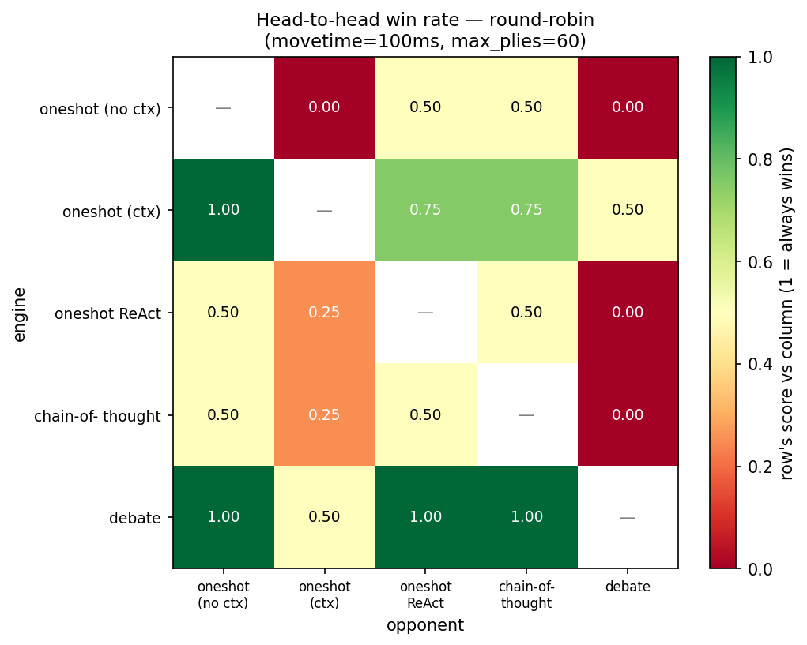</p>
<p align="center"><em>Head-to-head win-rate matrix (row engine score vs column engine). Fast read of directional matchups.</em></p>

<p align="center">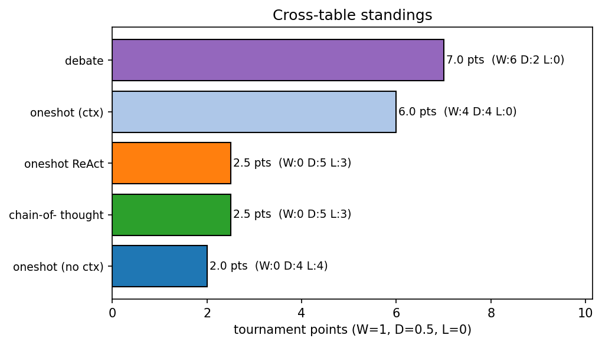</p>
<p align="center"><em>Cross-table standings with W/D/L decomposition.</em></p>

<p align="center">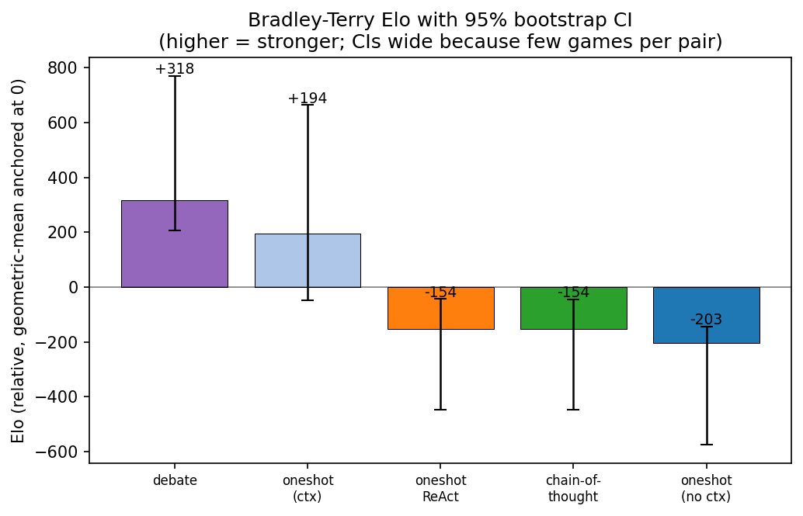</p>
<p align="center"><em>Bradley-Terry Elo with bootstrap confidence intervals from the same game set.</em></p>

<p align="center">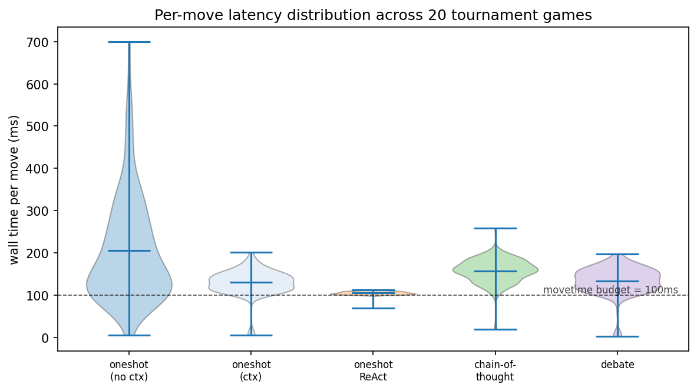</p>
<p align="center"><em>Move-time distributions (compute pressure / runtime profile).</em></p>

<p align="center">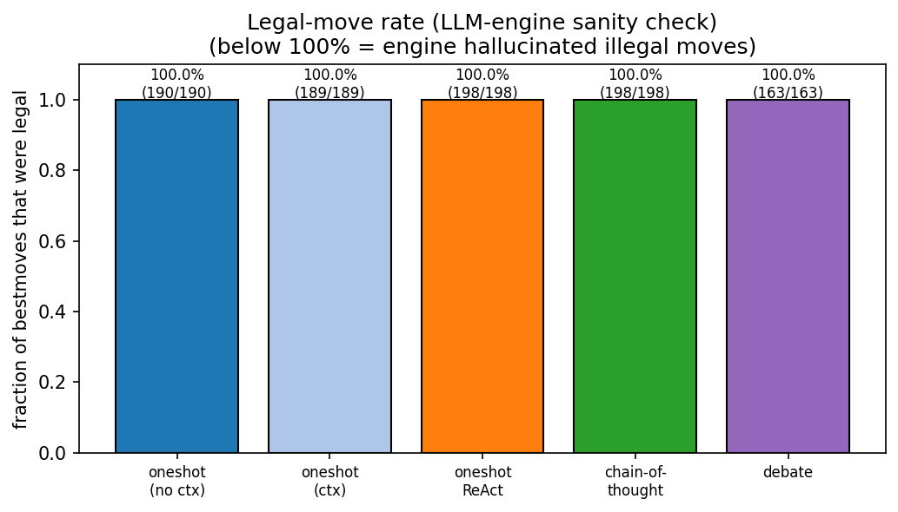</p>
<p align="center"><em>Legal-move rate (robustness and rules compliance under real play).</em></p>

<p align="center">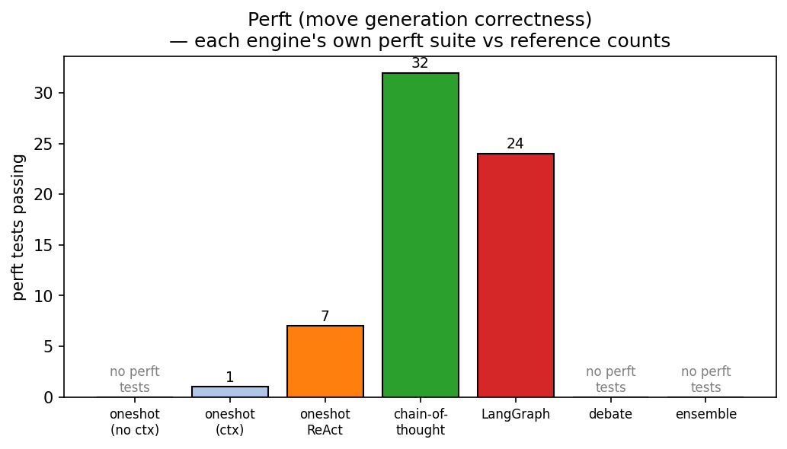</p>
<p align="center"><em>Perft correctness view from each engine's own perft tests.</em></p>

<p align="center">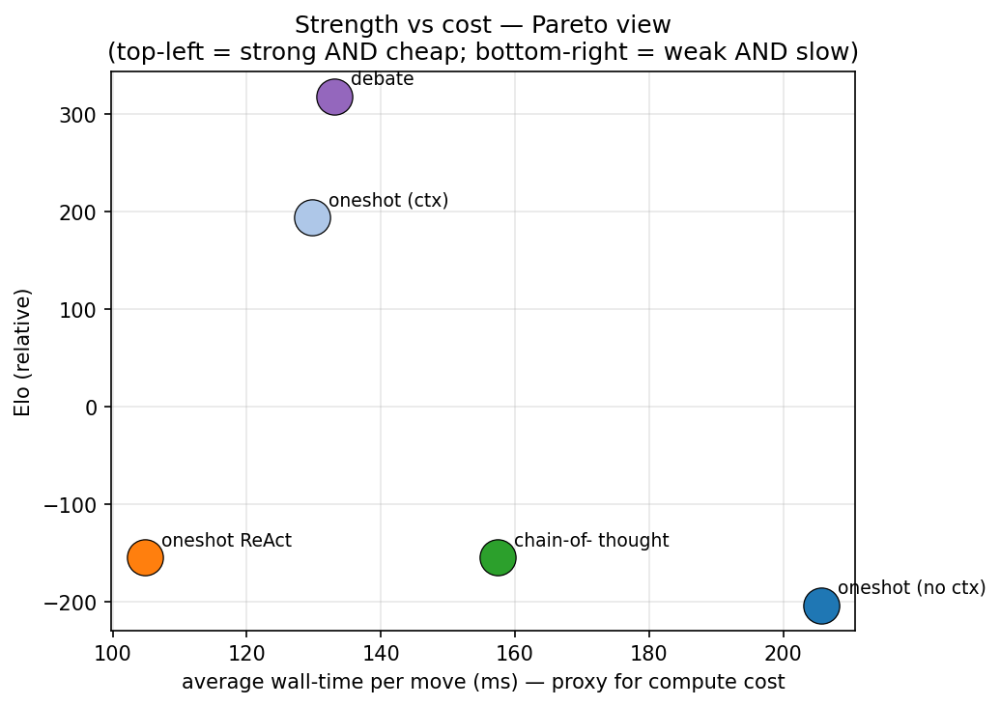</p>
<p align="center"><em>Strength vs cost proxy (Elo vs average move-time) Pareto view.</em></p>

<p align="center">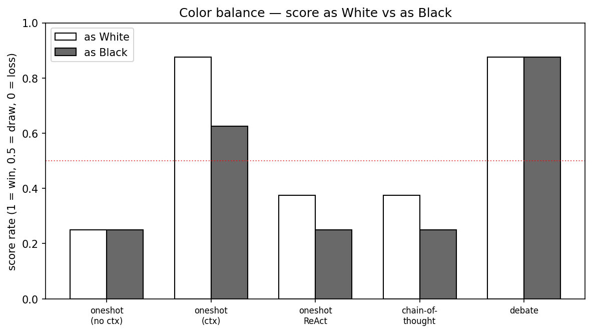</p>
<p align="center"><em>Color-balance check (score as White vs as Black).</em></p>

### Build token usage and cost (illustrative panel)

To keep comparisons complete while instrumentation is being finalized, we include an explicit estimate panel:

<p align="center">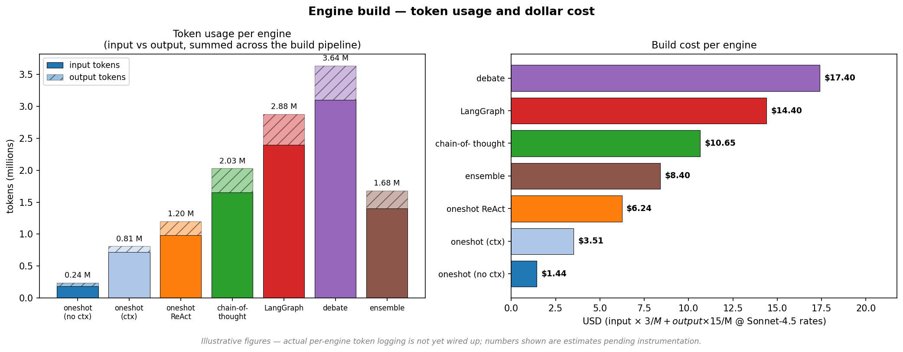</p>
<p align="center"><em>Estimated build token usage and cost per engine methodology (clearly marked as illustrative in the figure itself).</em></p>

### Engine-specific figure bundles

Each engine has its own figure folder with all generated panels (and per-engine highlighting where applicable):

- `engines/oneshot_nocontext/figures/`
- `engines/oneshot_contextualized/figures/`
- `engines/oneshot_react/figures/`
- `engines/chainofthought/figures/`
- `engines/langgraph/figures/`
- `engines/debate/figures/`
- `engines/ensemble/figures/`

Each folder includes:
`01_head_to_head_heatmap.png`, `02_cross_table_standings.png`, `03_bradley_terry_elo.png`, `04_movetime_distribution.png`, `05_legal_move_rate.png`, `06_perft_correctness.png`, `07_strength_vs_cost_pareto.png`, `08_white_vs_black_score.png`, `09_vs_stockfish_PLACEHOLDER.png`, `10_vs_commercial_LLMs_PLACEHOLDER.png`, `11_tokens_per_move_PLACEHOLDER.png`, and `12_build_token_usage_and_cost.png`.

### Test-first evidence summary

Testing is treated as a first-class outcome metric, not only a gating step:
- **Unit tests** validate board representation, move generation, search behavior, and utility layers inside each engine package.
- **Perft tests** validate legal move-tree counts against known references (critical for proving move generator correctness, not just tactical strength).
- **UCI contract tests** run the same protocol checks across every registered engine so conformance is comparable.
- **Arena/tournament tests** validate end-to-end gameplay behavior under repeated head-to-head play.

---

## AI usage and division of work

This project uses AI heavily but not opaquely. The workflow is explicit about where models were used and where humans stayed in the loop.

### AI usage in the development lifecycle

1. **Research acceleration**
   - LLMs were used to rapidly discover and summarize relevant papers for recursive prompting, multi-agent debate, orchestration, and chess-as-benchmark framing.
   - Candidate references were then manually curated into the methodology choices documented in this README.

2. **Code generation and iterative implementation**
   - Each engine and methodology was generated through structured prompting pipelines (one-shot, CoT, ReAct, LangGraph, debate, ensemble, recursive decomposition).
   - AI generated draft implementations for modules, tests, and orchestration scripts; humans validated behavior and merged selectively.

3. **Pre-push code review assistance**
   - LLM review was used as a fast first-pass reviewer before CI, to shorten feedback loops on obvious issues while waiting for slower full test pipelines.
   - CI remained the canonical gate; AI review was additive, not authoritative.

4. **Experiment analysis and reporting**
   - AI assisted in transforming raw logs into readable summaries, figure captions, and metric narratives.
   - Final interpretations remained grounded in the measured artifacts (`tournament_results.json`, `perft_results.json`, test outputs, and generated plots).

### Division of work (practical split)

- **AI-dominant tasks:** code scaffolding, prompt iteration, comparative design proposals, draft test creation, report drafting.
- **Human-dominant tasks:** experiment design, acceptance criteria, deciding decision-rule A/Bs (judge vs vote), metric selection, run governance, and final merge decisions.
- **Shared tasks:** debugging failing runs, refining prompts after regression, deciding when to replace a methodology component.

### Why this matters methodologically

Because AI is part of both the **object under test** (LLM-built engines) and the **build toolchain**, explicit process documentation is required for reproducibility. This README therefore separates:
- what was generated by which methodology,
- what was measured by which harness,
- and what was accepted after test/contract validation.

That separation is what lets the repository function as research infrastructure rather than just a collection of engine snapshots.

---

## Setup and run

### Prerequisites

- Python 3.11+
- Node 20+ (for dashboard/frontend)
- Optional but recommended: [Stockfish](https://stockfishchess.org/) on PATH (or set `STOCKFISH_PATH`)

### Install core Python deps

```bash
python3 -m venv .venv
.venv/bin/pip install -r requirements.txt
```

### Run an engine directly

```bash
# Example: no-context engine UI
.venv/bin/python -m engines.oneshot_nocontext

# Example: UCI mode
.venv/bin/python -m engines.oneshot_nocontext --uci
```

### Run interactive arena

```bash
.venv/bin/python -m arena
```

Then open: `http://127.0.0.1:8765`

### Arena environment variables

- `POINTCHESS_PYTHON` optionally overrides the Python executable used to launch registered engines.

---

## Testing

### Engine/package tests

```bash
.venv/bin/python -m pytest engines/oneshot_nocontext/tests -v
.venv/bin/python -m pytest engines/oneshot_contextualized/tests -v
```

### Arena tests

```bash
.venv/bin/python -m pytest arena/tests -q
```

### Candidate/champion workflow

See scripts:

- `infra/scripts/run_candidate_tests.py`
- `infra/scripts/run_champion_stage.py`
- `infra/scripts/aggregate_champion_artifacts.py`
- `infra/scripts/score_candidates.py`
- `infra/scripts/write_comparison_report.py`

Run the current engines in parallel:

```bash
.venv/bin/python infra/scripts/run_local_champion.py \
  --task CURRENT_ENGINES \
  --config infra/configs/champion/CURRENT_ENGINES.yaml \
  --jobs 7 \
  --skip-create-worktrees
```

Run the Dockerized Champion POC locally:

```bash
docker build -f infra/docker/Dockerfile.champion -t pointchess/champion:local .
docker run --rm -v "$PWD:/repo" -w /repo pointchess/champion:local \
  python infra/scripts/run_local_champion.py \
    --task CURRENT_ENGINES \
    --config infra/configs/champion/CURRENT_ENGINES.yaml \
    --jobs 7 \
    --skip-create-worktrees
```

Run a stronger tier or an orchestration audit:

```bash
.venv/bin/python infra/scripts/run_local_champion.py \
  --task CURRENT_ENGINES \
  --config infra/configs/champion/CURRENT_ENGINES.yaml \
  --tier contract \
  --jobs 7 \
  --skip-create-worktrees

.venv/bin/python infra/scripts/run_local_champion.py \
  --task CURRENT_ENGINES \
  --config infra/configs/champion/CURRENT_ENGINES.yaml \
  --candidate CURRENT_rlm \
  --milestone-task C0_ENGINE_INTERFACE \
  --run-orchestration \
  --orchestration-mode audit \
  --skip-create-worktrees
```

Run the full C0-C8 classical ladder in Docker:

```bash
docker run --rm -v "$PWD:/repo" -w /repo pointchess/champion:local \
  python infra/scripts/run_classical_ladder.py --task all --jobs 3
```

Run one configured C* candidate comparison in Docker, using host worktrees:

```bash
mkdir -p ../worktrees
docker run --rm \
  -v "$PWD:/repo" \
  -v "$PWD/../worktrees:/worktrees" \
  -w /repo \
  pointchess/champion:local \
  python infra/scripts/run_champion_stage.py \
    --task C3_STATIC_EVALUATION \
    --config infra/configs/champion/C3_STATIC_EVALUATION.yaml.example \
    --run-orchestration \
    --orchestration-mode audit \
    --run-tests \
    --score \
    --write-report \
    --jobs 4 \
    --allow-missing-worktrees \
    --continue-on-failure
```

Run the full candidate ladder across all C0-C8 configs:

```bash
docker run --rm \
  -v "$PWD:/repo" \
  -v "$PWD/../worktrees:/worktrees" \
  -w /repo \
  pointchess/champion:local \
  python infra/scripts/run_champion_ladder.py \
    --tasks all \
    --run-orchestration \
    --orchestration-mode audit \
    --allow-missing-worktrees \
    --continue-on-failure \
    --jobs 4
```

Run the actual builder plane before evaluation:

```bash
set -a
source .env
set +a

docker run --rm \
  -v "$PWD:/repo" \
  -v "$PWD/../worktrees:/worktrees" \
  -w /repo \
  -e POINTCHESS_DEFAULT_BUILDER_PROVIDER=anthropic \
  -e OPENAI_API_KEY \
  -e OPEN_AI_KEY \
  -e ANTHROPIC_API_KEY \
  -e ANTHROPIC_KEY \
  -e GEMINI_API_KEY \
  -e GEMINI_KEY \
  -e XAI_API_KEY \
  -e GROK_KEY \
  -e MOONSHOT_API_KEY \
  -e KIMI_KEY \
  -e DEEPSEEK_API_KEY \
  -e DEEPSEEK_KEY \
  pointchess/champion:local \
  python infra/scripts/run_champion_ladder.py \
    --tasks C0_ENGINE_INTERFACE \
    --create-worktrees \
    --run-builders \
    --builder-timeout 1800 \
    --commit-builds \
    --run-orchestration \
    --orchestration-mode audit \
    --continue-on-failure \
    --jobs 4
```

Or use the wrapper that does the same Dockerized live run after loading `.env`:

```bash
TASKS=C0_ENGINE_INTERFACE JOBS=4 TIER=smoke \
  infra/scripts/run_parallel_live_champion.sh
```

For a GIF-friendly live terminal dashboard, open a second terminal while the
run is active:

```bash
python infra/scripts/watch_champion.py \
  --config infra/configs/champion/C0_ENGINE_INTERFACE.yaml.example \
  --task C0_ENGINE_INTERFACE \
  --jobs 4
```

For local agent builds, use Claude Code directly. Docker/GitHub should usually
set `POINTCHESS_DEFAULT_BUILDER_PROVIDER=anthropic`; that sends non-RLM
candidates through Anthropic while keeping RLM candidates on the `rlms` path.
Local development can use `claude_cli` because host Claude auth is outside the
Champion image:

```bash
python infra/scripts/run_champion_ladder.py \
  --tasks C0_ENGINE_INTERFACE \
  --create-worktrees \
  --run-builders \
  --builder-provider claude_cli \
  --builder-timeout 1800 \
  --commit-builds \
  --run-orchestration \
  --orchestration-mode audit \
  --continue-on-failure \
  --jobs 4
```

Use `.env.example` as the local template, but never commit real provider keys.
For GitHub runs, store keys in repository secrets such as `ANTHROPIC_KEY`,
`OPENAI_API_KEY`, `GEMINI_API_KEY`, `XAI_API_KEY`, `MOONSHOT_API_KEY`, and
`DEEPSEEK_API_KEY`.

This produces `reports/comparisons/CHAMPION_LADDER/summary.md`. A task is only
considered promotable when at least one real candidate worktree passes; audit
traces alone do not count as implementation wins. By default, C* candidate
evaluation also rejects non-local worktrees that have no diff from the frozen
baseline, so a branch cannot win by merely inheriting already-passing code.

GitHub Actions workflow:

- `Champion Current Engines` runs each current engine as a separate Dockerized matrix job.
- `Champion Current Engines` can also run `smoke`, `contract`, `milestone`, `perft`, or `tournament` tiers.
- `Champion Classical Ladder` runs C0-C8 milestone gates as Docker matrix jobs.
- `Champion Milestone Candidates` runs a dynamic candidate matrix from any `infra/configs/champion/C*_*.yaml.example` file.
- `Champion Candidate Ladder` runs the whole C0-C8 candidate ladder sequentially from configured experiment branches.
- Aggregate jobs write `comparison.md`, `scores.md`, `scores.json`, `metrics.csv`, `metrics.jsonl`, and `metrics.json` for graphing.

---

## Repository map (current)

```text
PointChessEngine/
├── engines/                              # 8 UCI engines (the artifacts being compared)
│   ├── oneshot_nocontext/
│   ├── oneshot_contextualized/
│   ├── oneshot_react/
│   ├── chainofthought/
│   ├── langgraph/                        # built by methodologies/langgraph
│   ├── debate/                           # built by methodologies/debate
│   ├── ensemble/                         # built by methodologies/ensemble
│   └── rlm/                              # recursive-LM-inspired decomposition (methodologies/rlm)
├── methodologies/                        # the build orchestrators
│   ├── langgraph/                        # multi-agent specialists
│   ├── debate/                           # multi-model debate, Claude judges
│   ├── ensemble/                         # multi-model vote, no judge
│   └── rlm/                              # recursive-LM prompting recipe
├── arena/                                # web UI: engine-vs-engine + live metrics
│   ├── engines.py                        # REGISTRY of all 8 launchable engines
│   └── tests/                            # 28 unit tests w/ in-tree fake UCI engine
├── infra/
│   ├── agents/                           # methodology + parallelization protocols
│   ├── orchestrators/                    # orchestration schemas, debate runtime notes
│   ├── scripts/                          # candidate / champion runners + reporters
│   ├── tasks/                            # work plans, protocol docs
│   └── configs/                          # tournament + champion YAMLs
├── reports/                              # run / eval / comparison artifacts
├── tests/
│   ├── classical/                        # 59 milestone tests (currently grades oneshot_nocontext)
│   └── contract/                         # 63 UCI-contract tests parameterized over REGISTRY
└── .github/workflows/tests.yml           # CI: every test tree on every push + PR
```

---

## Known limitations

- LLM-driven approaches are prompt-sensitive and can have wide Elo confidence intervals
- Cost/latency variance is substantial for agentic and debate-style approaches
- Cross-approach transitivity assumptions in Elo are imperfect
- Some orchestration/eval components are still evolving and documented as protocol-first

---

## Related work and inspiration

The methodologies in this repo were shaped by recent work on recursive prompting, multi-model debate, and chess as a substrate for evaluating LLM-built systems. Brief notes on how each reference shaped a specific piece of the project:

### Recursive language models
- [`alexzhang13/rlm`](https://github.com/alexzhang13/rlm) and the [Recursive Language Models paper](https://arxiv.org/abs/2512.24601) — the recursive-LM pattern, where a model calls smaller / specialized LMs to compute its next answer. Directly inspired `engines/rlm/` and `methodologies/rlm/`.

### Multi-model debate and ensembling
- [Adaptive heterogeneous multi-agent debate for enhanced educational and factual reasoning in LLMs](https://link.springer.com/article/10.1007/s44443-025-00353-3) — empirical evidence that mixing model families in a debate loop improves reasoning quality. Shaped the multi-provider advisor pool in `methodologies/debate/`.
- MIT AI Safety Fundamentals weeks [5](https://web.mit.edu/aialignment/www/aisf/week5/) and [6](https://web.mit.edu/aialignment/www/aisf/week6/) — frame the judge-vs-vote distinction we A/B-tested across `methodologies/debate/` (single judge) and `methodologies/ensemble/` (peer plurality vote).

### LLMs and chess as an evaluation domain
- [Chess as a measurement substrate for LLM-driven systems (arXiv:2502.13295)](https://arxiv.org/abs/2502.13295) — motivates using chess to *grade* LLM-built systems, not only LLMs-as-players. This is the framing our scorecard inherits.

### Chess-engine references and tooling
- [Stockfish](https://stockfishchess.org/) — the canonical reference engine; every UCI engine in this repo is conceptually compared against it.
- [python-chess](https://python-chess.readthedocs.io/) — used by `arena/` and `tests/contract/` for legality, FEN/SAN/PGN, and game-end detection.
- [FastChess](https://github.com/Disservin/fastchess) — a faster alternative to cutechess for batch tournaments; candidate replacement for the current candidate/champion runners in `infra/scripts/`.
- ["Building my own chess engine" (healeycodes)](https://healeycodes.com/building-my-own-chess-engine) — a single-author engine walkthrough that helped scope what "minimal complete" means for the master brief every methodology builds against.
- [Universal Chess Interface on the Chess Programming Wiki](https://www.chessprogramming.org/UCI) and the [UCI overview on Wikipedia](https://en.wikipedia.org/wiki/Universal_Chess_Interface) — the protocol every engine in this repo speaks.

### Evaluation and observability tooling (forward-looking)
These aren't wired in yet but inform where the eval / monitoring layer is heading.

- ["Four places where you can put LLM monitoring"](https://www.alignmentforum.org/posts/AmcEyFErJc9TQ5ySF/four-places-where-you-can-put-llm-monitoring) — taxonomy that informs where evals should attach across the build, design-debate, and play-time loops.
- [Promptfoo](https://www.promptfoo.dev/) — candidate framework for prompt-level test cases on each methodology's design-phase prompts.
- [Weights & Biases Weave](https://wandb.ai/site/weave/) — candidate framework for per-run agent observability across `methodologies/debate/`, `methodologies/ensemble/`, and `methodologies/langgraph/`.

---

## Future work

- Broader model grid runs with tighter confidence bounds
- Additional framework-isolation experiments (same model/prompt, different runtime)
- Expanded robustness suite (metamorphic + adversarial probes)
- More complete cost-Elo Pareto reporting across all approach families

---

## Related docs in this repo

- `arena/README.md` - interactive arena usage
- `infra/agents/` - methodology and operational protocols
- `infra/orchestrators/` - orchestration schemas and runtime docs
- `infra/tasks/START_HERE.md` - guided task entrypoint

If you want the README to mirror your whitepaper structure even more closely, the next step is adding dedicated top-level docs (`WHITEPAPER.md`, `RELATED_WORK.md`, `decisions/log.md`, and `/docs` figures) and linking them from here.

---

## License

Released under the [MIT License](LICENSE). Copyright (c) 2026 Jeffrey Zhou, Maher Harp, Suraj Reddy, and Rohan Singh.
