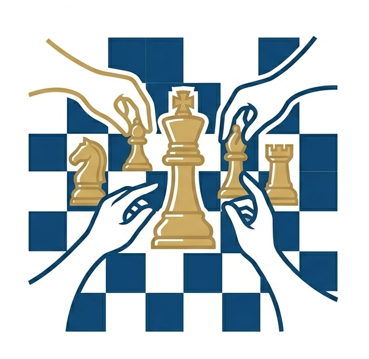

<p align="center">
  
</p>

<h1 align="center">Chess by Committee</h1>
<p align="center"><em>A methodology-driven experimental framework for AI-generated chess engines</em></p>

We did not build a single chess engine.
We built a structured experimental apparatus for generating and comparing chess engines under different AI methodologies, then measured the methodologies themselves.

---

## Overview

This repository investigates a core question:

**When an AI system builds a chess engine, which AI-usage methodology yields the strongest result for the lowest cost?**

The engine artifact is the output, not the endpoint. The endpoint is controlled comparison across:

- prompting patterns
- multi-agent topologies
- orchestration runtimes
- model choices
- parallelization strategies

Every approach is implemented end-to-end, evaluated in a unified harness, and reported on a multi-axis scorecard (quality, cost, latency, robustness, and engineering process).

---

## Why this project matters

Most chess+LLM work reports playing strength from one methodology. That conflates model quality with system design quality.

This project separates those variables. Chess is a clean evaluation domain:

- fixed rules
- strong oracle (`stockfish`)
- well-studied search space
- measurable failure modes (illegal moves, hallucinated board state, protocol errors)

That makes it a practical benchmark for the broader engineering question:

**How should AI teams structure their LLM workflows to maximize output quality per dollar?**

---

## Current repository scope

This repo currently contains multiple concrete engine implementations plus orchestration/testing infrastructure.

### Top-level layout

```
engines/         the chess-engine artifacts being compared (each speaks UCI)
methodologies/   the builders that produce engines (orchestration runtimes)
arena/           web UI for engine-vs-engine matches with live metrics
infra/           configs, scripts, agent/task/orchestrator protocol docs
reports/         run, eval, and comparison artifacts
tests/           cross-engine classical / contract tests
```

### The eight engines and their construction methods

The whole point of the repo is the controlled A/B/C/... across these.
Every engine is a complete, UCI-speaking, pure-Python alpha-beta
chess engine. What changes is **how it was produced.**

| engine                                | construction method                                                | who decided | who wrote the code |
|---------------------------------------|--------------------------------------------------------------------|-------------|--------------------|
| `engines/oneshot_nocontext/`          | one Claude prompt, no project context                              | Claude      | Claude             |
| `engines/oneshot_contextualized/`     | one Claude prompt with curated repo context                        | Claude      | Claude             |
| `engines/oneshot_react/`              | one ReAct-style prompt with tool access                            | Claude      | Claude             |
| `engines/chainofthought/`             | incremental chain-of-thought prompting                             | Claude      | Claude             |
| `engines/langgraph/`                  | LangGraph multi-agent orchestration: per-role specialists          | per-role    | per-role           |
| `engines/debate/`                     | multi-model design *debate* (OpenAI · Grok · Gemini · DeepSeek · Kimi) → Claude judges & builds | Claude (judge) | Claude             |
| `engines/ensemble/`                   | multi-model design *vote* (same advisors, no judge) → Claude builds | plurality   | Claude             |
| `engines/rlm/`                        | Recursive Language Model-inspired decomposition                    | Claude      | Claude             |

Each engine is registered in `arena/engines.py::REGISTRY`, so adding
a ninth engine is a one-line addition: every cross-engine test, the
arena UI, and the contract suite pick it up automatically.

### Methodologies (engine builders)

The build orchestrators that produce each non-trivial engine artifact:

- `methodologies/langgraph/` - LangGraph multi-agent specialists →
  `engines/langgraph/`
- `methodologies/debate/`    - multi-model debate with Claude as judge →
  `engines/debate/`
- `methodologies/ensemble/`  - multi-model voting with no judge →
  `engines/ensemble/`
- `methodologies/rlm/`       - Recursive-LM-style prompting recipe →
  `engines/rlm/`

The four `oneshot_*` and `chainofthought` engines are direct prompt
recipes; their methodology is captured in their own READMEs rather
than in a separate orchestrator module.

### Interactive arena: pit them against each other, see the numbers

`arena/` is a local web UI (`python -m arena` → `http://127.0.0.1:8765`)
that pits any two registered engines against each other in real time
and streams every metric you'd want for the comparison:

| metric                                  | source                                  |
|-----------------------------------------|-----------------------------------------|
| game result (W/D/L) and reason          | python-chess + arena rules              |
| per-move depth, nodes, NPS, score (cp / mate) | each engine's `info` UCI line     |
| per-move wall time                      | arena timer around `go`                 |
| cumulative engine clocks                | arena scoreboard                        |
| chess.com-style move arrows + eval bar  | arena UI                                |
| build cost ($), tokens, model           | `arena/engine_costs.json` (per engine)  |
| lines of code                           | computed by arena from each engine tree |

The arena is the live counterpart to the batch tournament harness in
`infra/scripts/`; both feed the same comparison reports.

For arena-specific details, see `arena/README.md`.

### Evaluation and orchestration assets

- `infra/agents/` - methodology/process protocols and parallelization plans
- `infra/orchestrators/` - orchestration schemas and debate runtime notes
- `infra/scripts/` - candidate scoring, champion tests, report generation
- `infra/tasks/` - work plans and protocol docs
- `reports/` - run/eval/comparison outputs
- `tests/` - classical/contract/dashboard tests

---

## Judging criteria alignment

### Creativity

- Heterogeneous debate personas and orchestration exploration in `infra/orchestrators/debate/`
- Stockfish-referenced decision loops in engine variants and eval scripts
- Persona/rating-aware behavior explored across approach families
- Geometric and format robustness treated as a separate eval concern from raw Elo

### Rigor

- Reproducible protocol docs in `infra/agents/` and `infra/tasks/`
- Tournament and candidate-stage automation in `infra/scripts/`
- Structured comparisons and reporting in `reports/comparisons/`
- Contract and integration-level tests under `tests/`

### Ingenuity

- Three-layer parallelization strategy (within-process, game-level, matrix-level)
- Multiple methodology families under one repo contract (one-shot, CoT, ReAct, graph/debate)
- Cost-aware experimentation and model/routing flexibility

### Engineering

- Modular engine packages with UCI adapters
- Shared orchestration protocols and stage gates
- Automated candidate/champion evaluation scripts
- Interactive local dashboard for live experiments

---

## System architecture (repository-aligned)

The framework has five replaceable layers:

1. **Engine implementations**  
   Engine packages listed above expose UCI-compatible behavior.

2. **Harness/orchestration glue**  
   Protocol and orchestration definitions in `infra/orchestrators/`, `infra/agents/`, `infra/tasks/`, and `infra/scripts/`.

3. **Tournament/evaluation**  
   Candidate/champion evaluation workflow in `infra/scripts/`, with artifacts in `reports/`.

4. **Parallel execution**  
   Strategy docs in `infra/agents/PARALLELIZATION_PLAN.md` plus branch-specific parallel demos.

5. **UI surface**  
   - Engine-specific web UIs inside each engine package  
   - Unified experiment dashboard in `dashboard/`

---

## AI methodology used in this project

This project treats AI as three separate roles:

1. **AI as builder**: helps produce harness/eval/UI code
2. **AI as player**: powers LLM-driven chess engines
3. **AI as judge/critic**: evaluates reasoning quality and process outputs where applicable

A central principle is human-reviewed iteration:

- proposed changes are tested and compared, not blindly accepted
- orchestration decisions are documented as protocols and stage gates
- performance/cost tradeoffs are measured, not assumed

---

## Experimental framework (approach spectrum)

The eight engines span the methodology axis from minimal to maximal
orchestration:

| family                          | engines                                                     |
|---------------------------------|-------------------------------------------------------------|
| **single-prompt baselines**     | `oneshot_nocontext`, `oneshot_contextualized`               |
| **single-prompt with reasoning / tools** | `chainofthought`, `oneshot_react`, `rlm`           |
| **multi-agent orchestration**   | `langgraph`                                                 |
| **multi-model collaboration**   | `debate` (judge-mediated), `ensemble` (peer vote)           |

These are evaluated comparatively through three layers:

1. **Contract layer** - `tests/contract/` runs the same UCI-surface
   checks against every engine in `arena.engines.REGISTRY` (handshake,
   legal-move guarantee, info-line semantics, lifecycle). 9 tests
   parameterized over every registered engine on every CI run.
2. **Arena layer** - live engine-vs-engine matches with streaming
   metrics (game outcome, depth, nodes, NPS, score, wall time, build
   cost).
3. **Tournament layer** - batch round-robin via
   `infra/scripts/run_local_champion.py` and the Dockerized GitHub
   Actions matrix; aggregate reports land in `reports/comparisons/`.

---

## Parallelization strategy

Three distinct bottlenecks are handled separately:

1. **LLM calls inside one game** (network bound)  
   Async concurrency and rate-limited orchestration

2. **Many games at once** (CPU/process bound)  
   Multi-game runners and engine process pools

3. **Full experiment matrix** (orchestration bound)  
   Batch workflows, staged candidate pipelines, and scheduled comparisons

See `infra/agents/PARALLELIZATION_PLAN.md` and `infra/scripts/` for concrete process flow.

---

## Setup and run

### Prerequisites

- Python 3.11+
- Node 20+ (for dashboard/frontend)
- Optional but recommended: `stockfish` on PATH or set `STOCKFISH_PATH`

### Install core Python deps

```bash
python3 -m venv .venv
.venv/bin/pip install -r requirements.txt
```

### Run an engine directly

```bash
# Example: no-context engine UI
.venv/bin/python -m engines.oneshot_nocontext

# Example: UCI mode
.venv/bin/python -m engines.oneshot_nocontext --uci
```

### Run interactive arena

```bash
.venv/bin/python -m arena
```

Then open: `http://127.0.0.1:8765`

### Arena environment variables

- `POINTCHESS_PYTHON` optionally overrides the Python executable used to launch registered engines.

---

## Testing

### Engine/package tests

```bash
.venv/bin/python -m pytest engines/oneshot_nocontext/tests -v
.venv/bin/python -m pytest engines/oneshot_contextualized/tests -v
```

### Arena tests

```bash
.venv/bin/python -m pytest arena/tests -q
```

### Candidate/champion workflow

See scripts:

- `infra/scripts/run_candidate_tests.py`
- `infra/scripts/run_champion_stage.py`
- `infra/scripts/aggregate_champion_artifacts.py`
- `infra/scripts/score_candidates.py`
- `infra/scripts/write_comparison_report.py`

Run the current engines in parallel:

```bash
.venv/bin/python infra/scripts/run_local_champion.py \
  --task CURRENT_ENGINES \
  --config infra/configs/champion/CURRENT_ENGINES.yaml \
  --jobs 7 \
  --skip-create-worktrees
```

Run the Dockerized Champion POC locally:

```bash
docker build -f infra/docker/Dockerfile.champion -t pointchess/champion:local .
docker run --rm -v "$PWD:/repo" -w /repo pointchess/champion:local \
  python infra/scripts/run_local_champion.py \
    --task CURRENT_ENGINES \
    --config infra/configs/champion/CURRENT_ENGINES.yaml \
    --jobs 7 \
    --skip-create-worktrees
```

GitHub Actions workflow:

- `Champion Current Engines` runs each current engine as a separate Dockerized matrix job.
- The aggregate job writes `reports/comparisons/CURRENT_ENGINES/comparison.md` and a GitHub summary.

---

## Repository map (current)

```text
PointChessEngine/
├── engines/                              # 8 UCI engines (the artifacts being compared)
│   ├── oneshot_nocontext/
│   ├── oneshot_contextualized/
│   ├── oneshot_react/
│   ├── chainofthought/
│   ├── langgraph/                        # built by methodologies/langgraph
│   ├── debate/                           # built by methodologies/debate
│   ├── ensemble/                         # built by methodologies/ensemble
│   └── rlm/                              # recursive-LM-inspired decomposition (methodologies/rlm)
├── methodologies/                        # the build orchestrators
│   ├── langgraph/                        # multi-agent specialists
│   ├── debate/                           # multi-model debate, Claude judges
│   ├── ensemble/                         # multi-model vote, no judge
│   └── rlm/                              # recursive-LM prompting recipe
├── arena/                                # web UI: engine-vs-engine + live metrics
│   ├── engines.py                        # REGISTRY of all 8 launchable engines
│   └── tests/                            # 28 unit tests w/ in-tree fake UCI engine
├── infra/
│   ├── agents/                           # methodology + parallelization protocols
│   ├── orchestrators/                    # orchestration schemas, debate runtime notes
│   ├── scripts/                          # candidate / champion runners + reporters
│   ├── tasks/                            # work plans, protocol docs
│   └── configs/                          # tournament + champion YAMLs
├── reports/                              # run / eval / comparison artifacts
├── tests/
│   ├── classical/                        # 59 milestone tests (currently grades oneshot_nocontext)
│   └── contract/                         # 63 UCI-contract tests parameterized over REGISTRY
└── .github/workflows/tests.yml           # CI: every test tree on every push + PR
```

---

## Known limitations

- LLM-driven approaches are prompt-sensitive and can have wide Elo confidence intervals
- Cost/latency variance is substantial for agentic and debate-style approaches
- Cross-approach transitivity assumptions in Elo are imperfect
- Some orchestration/eval components are still evolving and documented as protocol-first

---

## Future work

- Broader model grid runs with tighter confidence bounds
- Additional framework-isolation experiments (same model/prompt, different runtime)
- Expanded robustness suite (metamorphic + adversarial probes)
- More complete cost-Elo Pareto reporting across all approach families

---

## Related docs in this repo

- `arena/README.md` - interactive arena usage
- `infra/agents/` - methodology and operational protocols
- `infra/orchestrators/` - orchestration schemas and runtime docs
- `infra/tasks/START_HERE.md` - guided task entrypoint

If you want the README to mirror your whitepaper structure even more closely, the next step is adding dedicated top-level docs (`WHITEPAPER.md`, `RELATED_WORK.md`, `decisions/log.md`, and `/docs` figures) and linking them from here.
