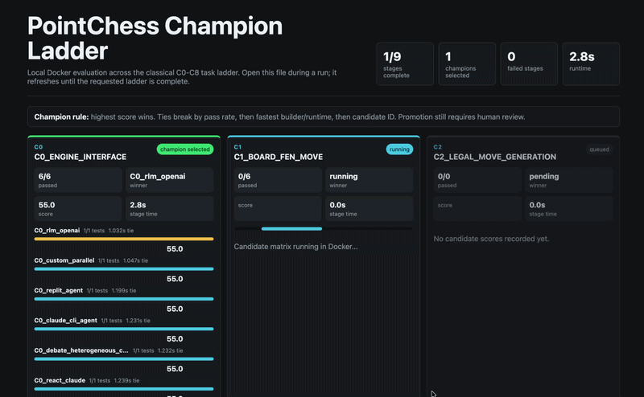
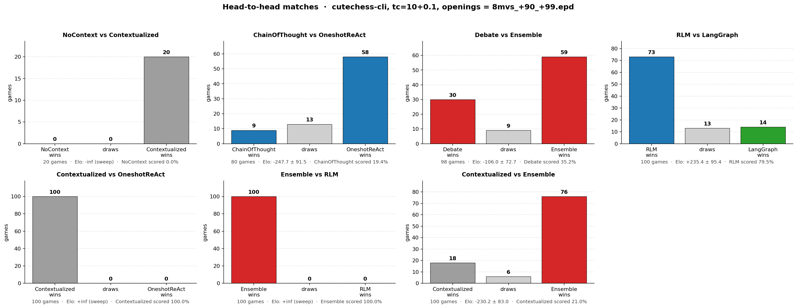
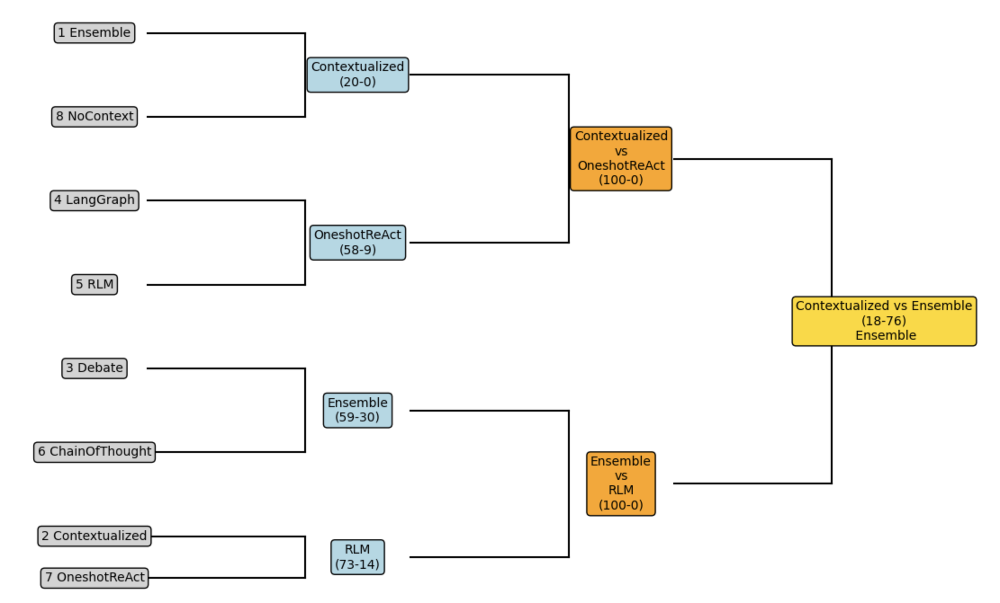
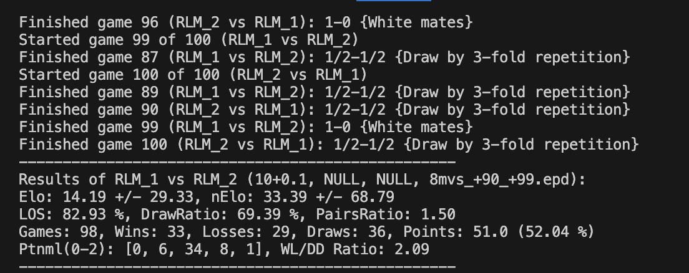

<p align="center">
  
</p>

<h1 align="center">F I S C H E R</h1>
<p align="center"><em>A methodology-driven experimental framework for AI-generated chess engines</em></p>

<p align="center">
  <a href="https://github.com/jeffreyzhou-harvard/PointChessEngine/stargazers">
    
  </a>
  <a href="https://github.com/jeffreyzhou-harvard/PointChessEngine/network/members">
    
  </a>
  <a href="https://github.com/jeffreyzhou-harvard/PointChessEngine/actions/workflows/tests.yml">
    
  </a>
  
</p>

Before implementing any methodology, we conducted extensive prior-art research and translated it into a controlled experimental framework for generating and comparing chess engines, so the primary result is not a single engine but a rigorous evaluation of the AI methodologies themselves.

---

## Contents

- [**Introduction**](#introduction) — research question, motivation, and hypothesis
- [**Methodology**](#methodology-repository-scope) — engines, measurement, observability, and parallelism
- [**Background**](#background) — shortened prior-art map with numbered references
- [**Results**](#results-current-snapshot) — tournament story, head-to-heads, and cost/robustness figures
- [**AI usage and division of work**](#ai-usage-and-division-of-work) — how AI was used and reviewed
- [**Repository map**](#repository-map-current) — directory-by-directory navigation
- [**Appendix**](#appendix-setup-and-run) — setup, testing, references, and judging criteria

---

## Introduction

This repository investigates a core research question:

**How do different meta-prompting methods (one-shot, contextualized one-shot, chain-of-thought, ReAct, recursive-LM decomposition) and agentic development frameworks (LangGraph specialist orchestration, multi-model judge-mediated debate, multi-model peer-vote ensembles) affect the resulting chess engine's playing strength, search efficiency, build cost, and runtime behavior?**

The chess engine artifact is the *unit of measurement* — not the endpoint. The endpoint is a controlled comparison along several axes that are usually conflated:

- **meta-prompting method** — one prompt vs. [chain-of-thought](https://arxiv.org/abs/2201.11903) vs. [ReAct](https://arxiv.org/abs/2210.03629) vs. recursive decomposition
- **agentic framework** — none vs. [LangGraph](https://www.langchain.com/langgraph) specialists vs. multi-model debate vs. peer-vote ensemble
- **decision rule** — single judge vs. plurality vote vs. per-role specialist
- **model mix** — single-provider (Claude) vs. multi-provider (OpenAI / Grok / Gemini / DeepSeek / Kimi / Claude)
- **parallelization strategy** — within-process / game-level / matrix-level

Each of the eight engines holds the *task* constant (build a complete [UCI](https://www.chessprogramming.org/UCI) chess engine satisfying the same brief) and varies one or more of these axes. Every engine is then graded on the same multi-axis scorecard:

- **playing strength** — head-to-head results in `arena/`, contract-test pass rate, classical-milestone score
- **search efficiency** — depth reached, nodes searched, NPS, eval quality per move
- **runtime cost** — wall time per move, cumulative game time
- **build cost** — total $ spent, total tokens, lines of code produced, build wall time
- **robustness** — illegal-move rate, UCI-compliance failures, crash/timeout behavior

---

## Our initial hypothesis

Going in, we expected that **the more an agent is forced to plan and reason about its own design choices before writing code, the higher-quality and more thoroughly built-out the resulting engine would be** — measured both as playing strength and as raw lines of code shipped. Concretely:

- **One-shot baselines** would underperform because the model commits to a design implicitly, never surfaces tradeoffs, and runs out of attention before fleshing out the harder modules (search extensions, ELO scaling, edge cases in legality).
- **Chain-of-thought and ReAct** would do better because the model is forced to think through the design before (or during) writing it — surfacing more tradeoffs, catching more edge cases, producing more code per topic.
- **Agentic frameworks with multiple parallel roles** (LangGraph specialists, multi-model debate, peer-vote ensembles) would be the *extension* of that idea: split the planning across several focused agents, let them critique each other, and let a synthesizer compile the result. More parallel "thinking" → more design coverage → more complete engine.

The project is structured to *test* that hypothesis rather than assume it: every engine implements the same brief under the same constraints (pure Python, stdlib only, full UCI surface, ELO slider 400–2400), and the only thing that varies is the meta-prompting method or agentic framework that produced it. If the hypothesis is right, we should see playing strength and LOC scale roughly with how much pre-implementation reasoning each methodology forces. If it's wrong — if a one-shot prompt with a strong model holds its own against multi-agent orchestration — that's the more interesting finding.

---

## Sneak peek

<p align="center">
  
</p>

<p align="center"><em>Two of our final generated engines going head-to-head inside our own tournament software (the <code>arena/</code> web UI).</em></p>

<p align="center">
  
</p>

<p align="center"><em>Tournament mode running for all 8 final generated engines.</em></p>

---

## Why this project matters

Most chess+LLM work reports playing strength from one methodology. That conflates model quality with system design quality.

This project separates those variables. Chess is a clean evaluation domain:

- fixed rules
- strong oracle ([Stockfish](https://stockfishchess.org/))
- well-studied search space
- measurable failure modes (illegal moves, hallucinated board state, protocol errors)

That makes it a practical benchmark for the broader engineering question:

**Given a fixed engineering task, which combination of meta-prompting method + agentic framework + model mix maximizes output quality per dollar — and is the marginal cost of more orchestration ever justified?**

---

## Background

The project draws from four lines of work: recursive decomposition, multi-agent debate, scalable oversight, and chess as a controlled systems benchmark. The important move is not to copy any one paper; it is to turn those ideas into executable methodology variants that build the same UCI chess engine under the same tests.

| Idea | How it maps into this repo | References |
|---|---|---|
| Recursive decomposition | `methodologies/rlm/` decomposes a chess-engine build into scoped subcalls and synthesizes their outputs into `engines/rlm/` | [1] |
| Heterogeneous debate | `methodologies/debate/` lets multiple model families propose designs before a judge synthesizes the implementation | [2], [7], [8] |
| Judge vs vote | `methodologies/debate/` and `methodologies/ensemble/` hold prompts/advisors constant while changing only the aggregation rule | [5], [6], [8] |
| Chess as benchmark | The engine is the measurement artifact; legality, UCI behavior, perft, tournaments, and cost all matter | [3] |
| Control/monitoring mindset | Champion mode treats tests, reviews, and candidate comparison as gates around untrusted generated code | [4], [5], [6] |

Selected references:

1. [Recursive Language Models](https://arxiv.org/abs/2512.24601) and [`alexzhang13/rlm`](https://github.com/alexzhang13/rlm).
2. [Adaptive heterogeneous multi-agent debate for enhanced educational and factual reasoning in LLMs](https://link.springer.com/article/10.1007/s44443-025-00353-3).
3. [Chess as a measurement substrate for LLM-driven systems](https://arxiv.org/abs/2502.13295).
4. [AI Control: Improving Safety Despite Intentional Subversion](https://arxiv.org/abs/2312.06942).
5. [On scalable oversight with weak LLMs judging strong LLMs](https://arxiv.org/abs/2407.04622).
6. [Weak-to-strong generalization](https://arxiv.org/abs/2312.09390).
7. [AI Safety via Debate](https://arxiv.org/abs/1805.00899).
8. [Debate Helps Supervise Unreliable Experts](https://arxiv.org/abs/2311.08702).

## Methodology: repository scope

This repo currently contains multiple concrete engine implementations plus orchestration/testing infrastructure.

### Top-level layout

```
engines/         the chess-engine artifacts being compared (each speaks UCI)
methodologies/   the builders that produce engines (orchestration runtimes)
arena/           web UI for engine-vs-engine matches with live metrics
infra/           configs, scripts, agent/task/orchestrator protocol docs
reports/         run, eval, and comparison artifacts
tests/           cross-engine classical / contract tests
```

### The eight engines and their construction methods

The whole point of the repo is the controlled A/B/C/... across these.
Every engine is a complete, UCI-speaking, pure-Python alpha-beta
chess engine. What changes is **how it was produced.**

| engine                                | construction method                                                | who decided | who wrote the code |
|---------------------------------------|--------------------------------------------------------------------|-------------|--------------------|
| `engines/oneshot_nocontext/`          | one Claude prompt, no project context                              | Claude      | Claude             |
| `engines/oneshot_contextualized/`     | one Claude prompt with curated repo context                        | Claude      | Claude             |
| `engines/oneshot_react/`              | one ReAct-style prompt with tool access                            | Claude      | Claude             |
| `engines/chainofthought/`             | incremental chain-of-thought prompting                             | Claude      | Claude             |
| `engines/langgraph/`                  | LangGraph multi-agent orchestration: per-role specialists          | per-role    | per-role           |
| `engines/debate/`                     | multi-model design *debate* (OpenAI · Grok · Gemini · DeepSeek · Kimi) → Claude judges & builds | Claude (judge) | Claude             |
| `engines/ensemble/`                   | multi-model design *vote* (same advisors, no judge) → Claude builds | plurality   | Claude             |
| `engines/rlm/`                        | Recursive Language Model-inspired decomposition                    | Claude      | Claude             |

<p align="center">
  
</p>

<p align="center"><em>Observability and chain-of-thought trace for the debate / ensemble architecture.</em></p>

Each engine is registered in `arena/engines.py::REGISTRY`, so adding
a ninth engine is a one-line addition: every cross-engine test, the
arena UI, and the contract suite pick it up automatically.

<p align="center">
  
</p>

<p align="center"><em>Lines of Python per generated engine (excludes tests, <code>__pycache__</code>, vendored deps), color-coded by methodology family. Regenerate with <code>python -m infra.scripts.plot_loc --csv</code>.</em></p>

### Methodologies (engine builders)

The build orchestrators that produce each non-trivial engine artifact:

- `methodologies/langgraph/` - LangGraph multi-agent specialists →
  `engines/langgraph/`
- `methodologies/debate/`    - multi-model debate with Claude as judge →
  `engines/debate/`
- `methodologies/ensemble/`  - multi-model voting with no judge →
  `engines/ensemble/`
- `methodologies/rlm/`       - Recursive-LM-style prompting recipe →
  `engines/rlm/`

The four `oneshot_*` and `chainofthought` engines are direct prompt
recipes; their methodology is captured in their own READMEs rather
than in a separate orchestrator module.

### Interactive arena: pit them against each other, see the numbers

`arena/` is a local web UI (`python -m arena` → `http://127.0.0.1:8765`)
that pits any two registered engines against each other in real time
and streams every metric you'd want for the comparison:

| metric                                  | source                                  |
|-----------------------------------------|-----------------------------------------|
| game result (W/D/L) and reason          | [python-chess](https://python-chess.readthedocs.io/) + arena rules |
| per-move depth, nodes, NPS, score (cp / mate) | each engine's `info` UCI line     |
| per-move wall time                      | arena timer around `go`                 |
| cumulative engine clocks                | arena scoreboard                        |
| [chess.com](https://www.chess.com/)-style move arrows + eval bar | arena UI                |
| build cost ($), tokens, model           | `arena/engine_costs.json` (per engine)  |
| lines of code                           | computed by arena from each engine tree |

The arena is the live counterpart to the batch tournament harness in
`infra/scripts/`; both feed the same comparison reports.

For arena-specific details, see `arena/README.md`.

### Evaluation and orchestration assets

- `infra/agents/` - methodology/process protocols and parallelization plans
- `infra/orchestrators/` - orchestration schemas and debate runtime notes
- `infra/scripts/` - candidate scoring, champion tests, report generation
- `infra/tasks/` - work plans and protocol docs
- `reports/` - run/eval/comparison outputs
- `tests/` - classical/contract/dashboard tests

---

## Methodology: what we measured, and how

The benchmark is not a single Elo number. Each engine exposes comparable telemetry so we can judge both the artifact and the AI workflow that produced it.

| Layer | What we capture | Why it matters |
|---|---|---|
| Per-move telemetry | Depth, nodes, NPS, score, wall time from UCI `info` lines and arena timers | Separates playing strength from compute profile |
| Build cost telemetry | Estimated build cost, token usage, model/provider, and build wall time | Lets us compare quality per dollar and per minute |
| Test telemetry | Unit, perft, UCI, and contract-test pass rates | Keeps legality and protocol correctness visible across engines |
| Tournament telemetry | W/L/D, pairwise scores, game length, color balance, legal-move rate, Elo-like estimates | Measures behavior under repeated play rather than isolated examples |
| Process telemetry | Agent traces, debate turns, orchestration logs, review notes, and Champion reports | Makes the AI workflow itself auditable and comparable |

---

## Observability via LangGraph

`engines/langgraph/` and `methodologies/langgraph/` are not just *another* engine — they are the project's primary observability surface. LangGraph models every multi-agent build as an explicit graph of typed nodes (specialist roles) and edges (state transitions). That gives us:

- **Replayable traces** — every state transition is dumped as a timestamped record. We can re-run the *same* graph on the *same* input and inspect where decisions branched without re-paying the LLM cost.
- **Per-role attribution** — when a final engine has a bug, we can walk back to the specific specialist node whose output introduced it. Single-prompt baselines can't do this.
- **A/B-able decision rules** — the judge-vs-vote distinction (`methodologies/debate/` vs `methodologies/ensemble/`) is one node-swap in a LangGraph definition. Swapping cost-per-pass dropped from "rebuild the orchestrator" to "edit one edge."

This is also what makes the eight-engine comparison fair: every multi-agent variant emits the same observability schema, so cross-method comparisons are apples-to-apples on **process metrics**, not just outcome metrics. `Promptfoo` (declarative prompt-level test cases) sits alongside this stack as the prompt-side analogue of unit tests — a regression suite that catches the moment a methodology's design-phase prompt stops producing a valid module spec, before any code is generated.

---

## Parallelism via per-task Docker containers

The repo has two parallel execution modes. One optimizes raw build speed; the other optimizes correctness by letting multiple AI-agent methodologies compete at each milestone.

### 1. Optimize for speed

Several engines ship a `docker_parallel_orchestrator/` subtree (see `engines/oneshot_contextualized/docker_parallel_orchestrator/`, `engines/oneshot_nocontext/docker_parallel_orchestrator/`, `engines/chainofthought/docker_parallel_orchestrator/`, and `engines/oneshot_react/docker_parallel_orchestrator/`). These orchestrators enact the build DAG as isolated Docker containers — one container per task — and launch any task whose dependencies are already satisfied.

Each container is functionally a tiny VM: separate filesystem, separate process tree, and no shared mutable state. The verifier reads each container's own `start_time` / `end_time` JSON, checks dependency ordering, confirms that declared parallel groups actually overlap, and verifies that every artifact lands on disk.

<p align="center">
  
</p>
<p align="center"><em>Four engine DAGs executing simultaneously. Within each band, independent subtasks fan out; across bands, separate engine builds overlap in real wall-clock time.</em></p>

### 2. Optimize for correctness

Champion mode runs AI-agent methodologies in parallel, giving each candidate its own isolated Docker/worktree context so separate agents can explore different implementation strategies without contaminating each other. At each C* milestone, candidates are tested, scored, and ranked; the best candidate becomes the new canonical baseline, and the next milestone restarts from that winner. This lets the strongest method win each stage while compressing wall-clock time through parallel agent work.

<p align="center">
  
</p>

<p align="center"><em>The CI dashboard GIF is a sped-up replay of the Champion loop: parallel AI-agent candidates, Docker gates, scoring, winner selection, and restart from the new baseline.</em></p>

---

## Methodology: system architecture

The framework has five replaceable layers:

1. **Engine implementations**  
   Engine packages listed above expose UCI-compatible behavior.

2. **Harness/orchestration glue**  
   Protocol and orchestration definitions in `infra/orchestrators/`, `infra/agents/`, `infra/tasks/`, and `infra/scripts/`.

3. **Tournament/evaluation**  
   Candidate/champion evaluation workflow in `infra/scripts/`, with artifacts in `reports/`.

4. **Parallel execution**  
   Strategy docs in `infra/agents/PARALLELIZATION_PLAN.md` plus branch-specific parallel demos.

5. **UI surface**  
   - Engine-specific web UIs inside each engine package  
   - Unified experiment dashboard in `dashboard/`

---

## AI methodology used in this project

This project treats AI as three separate roles:

1. **AI as builder**: helps produce harness/eval/UI code
2. **AI as player**: powers LLM-driven chess engines
3. **AI as judge/critic**: evaluates reasoning quality and process outputs where applicable

A central principle is human-reviewed iteration:

- proposed changes are tested and compared, not blindly accepted
- orchestration decisions are documented as protocols and stage gates
- performance/cost tradeoffs are measured, not assumed

---

## Methodology: approach spectrum

The eight engines span the methodology axis from minimal to maximal
orchestration:

| family                          | engines                                                     |
|---------------------------------|-------------------------------------------------------------|
| **single-prompt baselines**     | `oneshot_nocontext`, `oneshot_contextualized`               |
| **single-prompt with reasoning / tools** | `chainofthought`, `oneshot_react`, `rlm`           |
| **multi-agent orchestration**   | `langgraph`                                                 |
| **multi-model collaboration**   | `debate` (judge-mediated), `ensemble` (peer vote)           |

These are evaluated comparatively through three layers:

1. **Contract layer** - `tests/contract/` runs the same UCI-surface
   checks against every engine in `arena.engines.REGISTRY` (handshake,
   legal-move guarantee, info-line semantics, lifecycle). 9 tests
   parameterized over every registered engine on every CI run.
2. **Arena layer** - live engine-vs-engine matches with streaming
   metrics (game outcome, depth, nodes, NPS, score, wall time, build
   cost).
3. **Tournament layer** - batch round-robin via
   `infra/scripts/run_local_champion.py` and the Dockerized GitHub
   Actions matrix; aggregate reports land in `reports/comparisons/`.

---

## Methodology: parallelization strategy

Three distinct bottlenecks are handled separately:

1. **LLM calls inside one game** (network bound)  
   Async concurrency and rate-limited orchestration

2. **Many games at once** (CPU/process bound)  
   Multi-game runners and engine process pools

3. **Full experiment matrix** (orchestration bound)  
   Batch workflows, staged candidate pipelines, and scheduled comparisons

See `infra/agents/PARALLELIZATION_PLAN.md` and `infra/scripts/` for concrete process flow.

---

## Results (current snapshot)

The results tell a methodology story rather than a single-engine story. First, curated project context dominated a bare prompt. Second, different aggregation rules produced materially different engines even with similar advisor pools. Third, the Champion pipeline turns those comparisons into a repeatable selection loop: run candidates, score them, promote the winner, then continue from that baseline.

Everything below is additive and corresponds to artifacts already checked into this repo.

### Tournament snapshot (5-engine round-robin, 20 games)

Configuration used in the latest local batch:
- engines: `oneshot_nocontext`, `oneshot_contextualized`, `oneshot_react`, `chainofthought`, `debate`
- format: double round-robin (each pair plays both colors once)
- search budget: `movetime=100ms`, `max_plies=60`
- wall time: `137.41s`

Standings from `tournament_results.json`:

| rank | engine | points | W | D | L |
|------|--------|--------|---|---|---|
| 1 | `debate` | 7.0 | 6 | 2 | 0 |
| 2 | `oneshot_contextualized` | 6.0 | 4 | 4 | 0 |
| 3 | `oneshot_react` | 2.5 | 0 | 5 | 3 |
| 4 | `chainofthought` | 2.5 | 0 | 5 | 3 |
| 5 | `oneshot_nocontext` | 2.0 | 0 | 4 | 4 |

### Full round-robin (all 8 engines, fastchess)

We then re-ran the round-robin under [`fastchess`](https://github.com/Disservin/fastchess) with all eight engines included, longer per-engine sample sizes, and proper Elo error bars. Each engine's Elo is reported relative to the field; "Score" is the points percentage (1 win = 1 point, 1 draw = 0.5), and "Draws" is the share of games drawn. Logs in `reports/round_robin/`.

| rank | engine | Elo (±)              | games | score   | draws  |
|-----:|--------|----------------------|------:|---------|-------:|
| 1    | `ensemble`              | **+443.1 ± 180.1** |   76 |  92.8 % | 13.2 % |
| 2    | `oneshot_contextualized`| **+315.0 ± 149.4** |   82 |  86.0 % | 12.2 % |
| 3    | `debate`                | **+218.4 ± 136.9** |   70 |  77.9 % | 11.4 % |
| 4    | `langgraph`             |   −53.5 ± 106.7   |   72 |  42.4 % |  8.3 % |
| 5    | `rlm`                   |   −86.2 ± 112.1   |   74 |  37.8 % |  8.1 % |
| 6    | `chainofthought`        |  −217.6 ± 119.3   |   72 |  22.2 % | 11.1 % |
| 7    | `oneshot_react`         |  −237.9 ± 130.5   |   74 |  20.3 % |  5.4 % |
| 8    | `oneshot_nocontext`     |  −297.6 ± 141.7   |   72 |  15.3 % | 11.1 % |

The standings split cleanly into three tiers: a top group (`ensemble`, `oneshot_contextualized`, `debate`) that wins ≥78 % of points, a middle pair (`langgraph`, `rlm`) clustered near even, and a bottom group (`chainofthought`, `oneshot_react`, `oneshot_nocontext`) where adding reasoning or tool loops on top of a single prompt did *not* recover the gap left by missing repo context. The 1↔2 and 4↔5 gaps are inside their respective error bars, so treat those as ties; everything else is well-separated.

### Targeted head-to-head matches (cutechess-cli, fast TC)

To complement the round-robin above, we ran seven focused engine-vs-engine matches in [`cutechess-cli`](https://github.com/cutechess/cutechess) at `tc=10+0.1` using the `data/openings/8mvs_+90_+99.epd` opening book. Each cell below is the W / D / L from the perspective of the first-named engine; the elo column is from the same perspective.

<p align="center">
  
</p>

<p align="center"><em>Seven head-to-head matchups, color-coded by methodology family (grey = single-prompt baseline, blue = single-prompt + reasoning/tools, green = multi-agent orchestration, red = multi-model collaboration). Reproducible via <code>python -m infra.scripts.plot_head_to_head</code>; raw cutechess logs in <code>reports/head_to_head/</code>.</em></p>

| matchup (A vs B)                       | games | A wins | draws | B wins | A score | Elo (A's perspective)    |
|----------------------------------------|------:|------:|------:|------:|---------|--------------------------|
| `oneshot_nocontext` vs `oneshot_contextualized` |  20 |   0   |   0   |  20   | 0.0 %   | -inf (sweep)             |
| `chainofthought` vs `oneshot_react`    |    80 |   9   |  13   |  58   | 19.4 %  | -247.7 ± 91.5            |
| `debate` vs `ensemble`                 |    98 |  30   |   9   |  59   | 35.2 %  | -106.0 ± 72.7            |
| `rlm` vs `langgraph`                   |   100 |  73   |  13   |  14   | 79.5 %  | **+235.4 ± 95.4**        |
| `oneshot_contextualized` vs `oneshot_react` | 100 | 100   |   0   |   0   | 100.0 % | +inf (sweep)             |
| `ensemble` vs `rlm`                    |   100 | 100   |   0   |   0   | 100.0 % | +inf (sweep)             |
| `oneshot_contextualized` vs `ensemble` |   100 |  18   |   6   |  76   | 21.0 %  | -230.2 ± 83.0            |

<p align="center">
  
</p>

<p align="center"><em>The same head-to-head matches re-projected as a single-elimination bracket seeded from the 8-engine round-robin standings. Quarterfinals are pulled from the seven matches in the table above; both semifinals and the final were run as full 100-game matches under the same configuration.</em></p>

**What this tells us, holding game-time constant:**

- **Curated context dominates a bare prompt.** `oneshot_contextualized` swept `oneshot_nocontext` 20-0 and swept `oneshot_react` 100-0. Of every axis we vary, "give the model access to the existing repo" was the single largest move-the-needle change.
- **Multi-model voting outperforms multi-model judging — in this build.** `ensemble` beat `debate` 59-30-9 and went on to beat every other engine it played (sweeping `rlm` 100-0 and beating `oneshot_contextualized` 76-18-6). The build with a Claude judge produced a noticeably weaker engine than the same advisor pool resolved by plurality vote.
- **Recursion beat orchestration, locally.** `rlm` (Recursive-LM-style decomposition) beat `langgraph` (multi-agent specialist orchestration) 73-14-13, ≈+235 Elo. The structured-recursion build was both stronger and shorter than the orchestrated multi-agent build.
- **Tool access edged out raw chain-of-thought.** `oneshot_react` beat `chainofthought` 58-9-13. Adding a tool loop produced a stronger engine than adding incremental reasoning steps to the same single prompt.
- **An implied transitive ranking from these seven matches:** ensemble > {contextualized, debate, rlm} > {oneshot_react, langgraph} > chainofthought > nocontext. Treat this as suggestive (small samples, fast TC, no error correction across matchups) rather than as a published Elo ladder.

A note on the `+inf` / `-inf` rows: those engines won 100% (or 0%) of decisive games, so the maximum-likelihood Elo estimator from cutechess's formula has no finite solution. They're sweeps, not statistical claims. The error bars on the others are cutechess's own ± values and are wide for a reason — 80-100 games at fast TC is enough to see clear tendencies but not enough to nail down rating differences to within 50 Elo.

Core comparison figures generated from the round-robin run:

<p align="center"></p>
<p align="center"><em>Head-to-head win-rate matrix (row engine score vs column engine). Fast read of directional matchups.</em></p>

<p align="center"></p>
<p align="center"><em>Cross-table standings with W/D/L decomposition.</em></p>

<p align="center"></p>
<p align="center"><em>Bradley-Terry Elo with bootstrap confidence intervals from the same game set.</em></p>

<p align="center"></p>
<p align="center"><em>Move-time distributions (compute pressure / runtime profile).</em></p>

<p align="center"></p>
<p align="center"><em>Legal-move rate (robustness and rules compliance under real play).</em></p>

<p align="center"></p>
<p align="center"><em>Perft correctness view from each engine's own perft tests.</em></p>

<p align="center"></p>
<p align="center"><em>Strength vs cost proxy (Elo vs average move-time) Pareto view.</em></p>

<p align="center"></p>
<p align="center"><em>Color-balance check (score as White vs as Black).</em></p>

### Build token usage and cost (illustrative panel)

To keep comparisons complete while instrumentation is being finalized, we include an explicit estimate panel:

<p align="center"></p>
<p align="center"><em>Estimated build token usage and cost per engine methodology (clearly marked as illustrative in the figure itself).</em></p>

### Engine-specific figure bundles

Each engine has its own figure folder with all generated panels (and per-engine highlighting where applicable):

- `engines/oneshot_nocontext/figures/`
- `engines/oneshot_contextualized/figures/`
- `engines/oneshot_react/figures/`
- `engines/chainofthought/figures/`
- `engines/langgraph/figures/`
- `engines/debate/figures/`
- `engines/ensemble/figures/`

Each folder includes:
`01_head_to_head_heatmap.png`, `02_cross_table_standings.png`, `03_bradley_terry_elo.png`, `04_movetime_distribution.png`, `05_legal_move_rate.png`, `06_perft_correctness.png`, `07_strength_vs_cost_pareto.png`, `08_white_vs_black_score.png`, `09_vs_stockfish_PLACEHOLDER.png`, `10_vs_commercial_LLMs_PLACEHOLDER.png`, `11_tokens_per_move_PLACEHOLDER.png`, and `12_build_token_usage_and_cost.png`.

### Test-first evidence summary

Testing is treated as a first-class outcome metric, not only a gating step:
- **Unit tests** validate board representation, move generation, search behavior, and utility layers inside each engine package.
- **Perft tests** validate legal move-tree counts against known references (critical for proving move generator correctness, not just tactical strength).
- **UCI contract tests** run the same protocol checks across every registered engine so conformance is comparable.
- **Arena/tournament tests** validate end-to-end gameplay behavior under repeated head-to-head play.

---

## AI usage and division of work

This project uses AI heavily but not opaquely. The workflow is explicit about where models were used and where humans stayed in the loop.

### AI usage in the development lifecycle

1. **Research acceleration**
   - LLMs were used to rapidly discover and summarize relevant papers for recursive prompting, multi-agent debate, orchestration, and chess-as-benchmark framing.
   - Candidate references were then manually curated into the methodology choices documented in this README.

2. **Code generation and iterative implementation**
   - Each engine and methodology was generated through structured prompting pipelines (one-shot, CoT, ReAct, LangGraph, debate, ensemble, recursive decomposition).
   - AI generated draft implementations for modules, tests, and orchestration scripts; humans validated behavior and merged selectively.

3. **Pre-push code review assistance**
   - LLM review was used as a fast first-pass reviewer before CI, to shorten feedback loops on obvious issues while waiting for slower full test pipelines.
   - CI remained the canonical gate; AI review was additive, not authoritative.

4. **Experiment analysis and reporting**
   - AI assisted in transforming raw logs into readable summaries, figure captions, and metric narratives.
   - Final interpretations remained grounded in the measured artifacts (`tournament_results.json`, `perft_results.json`, test outputs, and generated plots).

### Division of work (practical split)

- **AI-dominant tasks:** code scaffolding, prompt iteration, comparative design proposals, draft test creation, report drafting.
- **Human-dominant tasks:** experiment design, acceptance criteria, deciding decision-rule A/Bs (judge vs vote), metric selection, run governance, and final merge decisions.
- **Shared tasks:** debugging failing runs, refining prompts after regression, deciding when to replace a methodology component.

### Why this matters methodologically

Because AI is part of both the **object under test** (LLM-built engines) and the **build toolchain**, explicit process documentation is required for reproducibility. This README therefore separates:
- what was generated by which methodology,
- what was measured by which harness,
- and what was accepted after test/contract validation.

That separation is what lets the repository function as research infrastructure rather than just a collection of engine snapshots.

---

## Repository map (current)

```text
PointChessEngine/
├── engines/                              # 8 UCI engines (the artifacts being compared)
│   ├── oneshot_nocontext/
│   ├── oneshot_contextualized/
│   ├── oneshot_react/
│   ├── chainofthought/
│   ├── langgraph/                        # built by methodologies/langgraph
│   ├── debate/                           # built by methodologies/debate
│   ├── ensemble/                         # built by methodologies/ensemble
│   └── rlm/                              # recursive-LM-inspired decomposition (methodologies/rlm)
├── methodologies/                        # the build orchestrators
│   ├── langgraph/                        # multi-agent specialists
│   ├── debate/                           # multi-model debate, Claude judges
│   ├── ensemble/                         # multi-model vote, no judge
│   └── rlm/                              # recursive-LM prompting recipe
├── arena/                                # web UI: engine-vs-engine + live metrics
│   ├── engines.py                        # REGISTRY of all 8 launchable engines
│   └── tests/                            # 28 unit tests w/ in-tree fake UCI engine
├── infra/
│   ├── agents/                           # methodology + parallelization protocols
│   ├── orchestrators/                    # orchestration schemas, debate runtime notes
│   ├── scripts/                          # candidate / champion runners + reporters
│   ├── tasks/                            # work plans, protocol docs
│   └── configs/                          # tournament + champion YAMLs
├── reports/                              # run / eval / comparison artifacts
├── tests/
│   ├── classical/                        # 59 milestone tests (currently grades oneshot_nocontext)
│   └── contract/                         # 63 UCI-contract tests parameterized over REGISTRY
└── .github/workflows/tests.yml           # CI: every test tree on every push + PR
```

---

## Known limitations

- LLM-driven approaches are prompt-sensitive and can have wide Elo confidence intervals
- Cost/latency variance is substantial for agentic and debate-style approaches
- Cross-approach transitivity assumptions in Elo are imperfect
- Some orchestration/eval components are still evolving and documented as protocol-first

---

## Appendix: Related work and inspiration

The methodologies in this repo were shaped by recent work on recursive prompting, multi-model debate, and chess as a substrate for evaluating LLM-built systems. Brief notes on how each reference shaped a specific piece of the project:

### Recursive language models
- [`alexzhang13/rlm`](https://github.com/alexzhang13/rlm) and the [Recursive Language Models paper](https://arxiv.org/abs/2512.24601) — the recursive-LM pattern, where a model calls smaller / specialized LMs to compute its next answer. Directly inspired `engines/rlm/` and `methodologies/rlm/`.

### Multi-model debate and ensembling
- [Adaptive heterogeneous multi-agent debate for enhanced educational and factual reasoning in LLMs](https://link.springer.com/article/10.1007/s44443-025-00353-3) — empirical evidence that mixing model families in a debate loop improves reasoning quality. Shaped the multi-provider advisor pool in `methodologies/debate/`.
- Scalable-oversight and debate references [5], [6], [7], and [8] above frame the judge-vs-vote distinction we A/B-tested across `methodologies/debate/` (single judge) and `methodologies/ensemble/` (peer plurality vote).

### LLMs and chess as an evaluation domain
- [Chess as a measurement substrate for LLM-driven systems (arXiv:2502.13295)](https://arxiv.org/abs/2502.13295) — motivates using chess to *grade* LLM-built systems, not only LLMs-as-players. This is the framing our scorecard inherits.

### Chess-engine references and tooling
- [Stockfish](https://stockfishchess.org/) — the canonical reference engine; every UCI engine in this repo is conceptually compared against it.
- [python-chess](https://python-chess.readthedocs.io/) — used by `arena/` and `tests/contract/` for legality, FEN/SAN/PGN, and game-end detection.
- [FastChess](https://github.com/Disservin/fastchess) — a faster alternative to cutechess for batch tournaments; candidate replacement for the current candidate/champion runners in `infra/scripts/`.
- ["Building my own chess engine" (healeycodes)](https://healeycodes.com/building-my-own-chess-engine) — a single-author engine walkthrough that helped scope what "minimal complete" means for the master brief every methodology builds against.
- [Universal Chess Interface on the Chess Programming Wiki](https://www.chessprogramming.org/UCI) and the [UCI overview on Wikipedia](https://en.wikipedia.org/wiki/Universal_Chess_Interface) — the protocol every engine in this repo speaks.

### Evaluation and observability tooling (forward-looking)
These aren't wired in yet but inform where the eval / monitoring layer is heading.

- ["Four places where you can put LLM monitoring"](https://www.alignmentforum.org/posts/AmcEyFErJc9TQ5ySF/four-places-where-you-can-put-llm-monitoring) — taxonomy that informs where evals should attach across the build, design-debate, and play-time loops.
- [Promptfoo](https://www.promptfoo.dev/) — candidate framework for prompt-level test cases on each methodology's design-phase prompts.
- [Weights & Biases Weave](https://wandb.ai/site/weave/) — candidate framework for per-run agent observability across `methodologies/debate/`, `methodologies/ensemble/`, and `methodologies/langgraph/`.

---

## Future work

- Broader model grid runs with tighter confidence bounds
- Additional framework-isolation experiments (same model/prompt, different runtime)
- Expanded robustness suite (metamorphic + adversarial probes)
- More complete cost-Elo Pareto reporting across all approach families

---

## Related docs in this repo

- `arena/README.md` - interactive arena usage
- `infra/agents/` - methodology and operational protocols
- `infra/orchestrators/` - orchestration schemas and runtime docs
- `infra/tasks/START_HERE.md` - guided task entrypoint

---

## Appendix: Setup and run

### Prerequisites

- Python 3.11+
- Node 20+ (for dashboard/frontend)
- Optional but recommended: [Stockfish](https://stockfishchess.org/) on PATH (or set `STOCKFISH_PATH`)

### Install core Python deps

```bash
python3 -m venv .venv
.venv/bin/pip install -r requirements.txt
```

### Run an engine directly

```bash
# Example: no-context engine UI
.venv/bin/python -m engines.oneshot_nocontext

# Example: UCI mode
.venv/bin/python -m engines.oneshot_nocontext --uci
```

### Run interactive arena

```bash
.venv/bin/python -m arena
```

Then open: `http://127.0.0.1:8765`

### Arena environment variables

- `POINTCHESS_PYTHON` optionally overrides the Python executable used to launch registered engines.

---

## Appendix: Testing and Champion commands

<p align="center">
  
</p>

<p align="center"><em>Sample fastchess output from one of the matches in this appendix: an RLM self-play sanity run (logs in <code>reports/semifinals/game_rlm_vs_rlm*</code>). Every test command below produces output in this format.</em></p>

### Engine/package tests

```bash
.venv/bin/python -m pytest engines/oneshot_nocontext/tests -v
.venv/bin/python -m pytest engines/oneshot_contextualized/tests -v
```

### Arena tests

```bash
.venv/bin/python -m pytest arena/tests -q
```

### Candidate/champion workflow

See scripts:

- `infra/scripts/run_candidate_tests.py`
- `infra/scripts/run_champion_stage.py`
- `infra/scripts/aggregate_champion_artifacts.py`
- `infra/scripts/score_candidates.py`
- `infra/scripts/write_comparison_report.py`

Run the current engines in parallel:

```bash
.venv/bin/python infra/scripts/run_local_champion.py \
  --task CURRENT_ENGINES \
  --config infra/configs/champion/CURRENT_ENGINES.yaml \
  --jobs 8 \
  --skip-create-worktrees
```

Run the Dockerized Champion POC locally:

```bash
docker build -f infra/docker/Dockerfile.champion -t pointchess/champion:local .
docker run --rm -v "$PWD:/repo" -w /repo pointchess/champion:local \
  python infra/scripts/run_local_champion.py \
    --task CURRENT_ENGINES \
    --config infra/configs/champion/CURRENT_ENGINES.yaml \
    --jobs 8 \
    --skip-create-worktrees
```

Run the local Docker visual demo:

```bash
docker build -f infra/docker/Dockerfile.champion -t pointchess/champion:local .
infra/scripts/run_current_champion_visualized.sh
```

This launches one Docker container per current engine, shows a live two-stage
terminal dashboard, then writes `reports/comparisons/CURRENT_ENGINES/local_docker_visual.md`.

Run a stronger tier or an orchestration audit:

```bash
.venv/bin/python infra/scripts/run_local_champion.py \
  --task CURRENT_ENGINES \
  --config infra/configs/champion/CURRENT_ENGINES.yaml \
  --tier contract \
  --jobs 8 \
  --skip-create-worktrees

.venv/bin/python infra/scripts/run_local_champion.py \
  --task CURRENT_ENGINES \
  --config infra/configs/champion/CURRENT_ENGINES.yaml \
  --candidate CURRENT_rlm \
  --milestone-task C0_ENGINE_INTERFACE \
  --run-orchestration \
  --orchestration-mode audit \
  --skip-create-worktrees
```

Run the full C0-C8 classical ladder in Docker:

```bash
docker run --rm -v "$PWD:/repo" -w /repo pointchess/champion:local \
  python infra/scripts/run_classical_ladder.py --task all --jobs 3
```

Run one configured C* candidate comparison in Docker, using host worktrees:

```bash
mkdir -p ../worktrees
docker run --rm \
  -v "$PWD:/repo" \
  -v "$PWD/../worktrees:/worktrees" \
  -w /repo \
  pointchess/champion:local \
  python infra/scripts/run_champion_stage.py \
    --task C3_STATIC_EVALUATION \
    --config infra/configs/champion/C3_STATIC_EVALUATION.yaml.example \
    --run-orchestration \
    --orchestration-mode audit \
    --run-tests \
    --score \
    --write-report \
    --jobs 4 \
    --allow-missing-worktrees \
    --continue-on-failure
```

Run the full candidate ladder across all C0-C8 configs:

```bash
docker run --rm \
  -v "$PWD:/repo" \
  -v "$PWD/../worktrees:/worktrees" \
  -w /repo \
  pointchess/champion:local \
  python infra/scripts/run_champion_ladder.py \
    --tasks all \
    --run-orchestration \
    --orchestration-mode audit \
    --allow-missing-worktrees \
    --continue-on-failure \
    --jobs 4
```

Run the actual builder plane before evaluation:

```bash
set -a
source .env
set +a

docker run --rm \
  -v "$PWD:/repo" \
  -v "$PWD/../worktrees:/worktrees" \
  -w /repo \
  -e POINTCHESS_DEFAULT_BUILDER_PROVIDER=anthropic \
  -e OPENAI_API_KEY \
  -e OPEN_AI_KEY \
  -e ANTHROPIC_API_KEY \
  -e ANTHROPIC_KEY \
  -e GEMINI_API_KEY \
  -e GEMINI_KEY \
  -e XAI_API_KEY \
  -e GROK_KEY \
  -e MOONSHOT_API_KEY \
  -e KIMI_KEY \
  -e DEEPSEEK_API_KEY \
  -e DEEPSEEK_KEY \
  pointchess/champion:local \
  python infra/scripts/run_champion_ladder.py \
    --tasks C0_ENGINE_INTERFACE \
    --create-worktrees \
    --run-builders \
    --builder-timeout 1800 \
    --commit-builds \
    --run-orchestration \
    --orchestration-mode audit \
    --continue-on-failure \
    --jobs 4
```

Or use the wrapper that does the same Dockerized live run after loading `.env`:

```bash
TASKS=C0_ENGINE_INTERFACE JOBS=4 TIER=smoke \
  infra/scripts/run_parallel_live_champion.sh
```

For a GIF-friendly live terminal dashboard, open a second terminal while the
run is active:

```bash
python infra/scripts/watch_champion.py \
  --config infra/configs/champion/C0_ENGINE_INTERFACE.yaml.example \
  --task C0_ENGINE_INTERFACE \
  --jobs 4
```

For local agent builds, use Claude Code directly. Docker/GitHub should usually
set `POINTCHESS_DEFAULT_BUILDER_PROVIDER=anthropic`; that sends non-RLM
candidates through Anthropic while keeping RLM candidates on the `rlms` path.
Local development can use `claude_cli` because host Claude auth is outside the
Champion image:

```bash
python infra/scripts/run_champion_ladder.py \
  --tasks C0_ENGINE_INTERFACE \
  --create-worktrees \
  --run-builders \
  --builder-provider claude_cli \
  --builder-timeout 1800 \
  --commit-builds \
  --run-orchestration \
  --orchestration-mode audit \
  --continue-on-failure \
  --jobs 4
```

Use `.env.example` as the local template, but never commit real provider keys.
For GitHub runs, store keys in repository secrets such as `ANTHROPIC_KEY`,
`OPENAI_API_KEY`, `GEMINI_API_KEY`, `XAI_API_KEY`, `MOONSHOT_API_KEY`, and
`DEEPSEEK_API_KEY`.

This produces `reports/comparisons/CHAMPION_LADDER/summary.md`. A task is only
considered promotable when at least one real candidate worktree passes; audit
traces alone do not count as implementation wins. By default, C* candidate
evaluation also rejects non-local worktrees that have no diff from the frozen
baseline, so a branch cannot win by merely inheriting already-passing code.

GitHub Actions workflow:

- `Champion Current Engines` runs each current engine as a separate Dockerized matrix job.
- `Champion Current Engines` can also run `smoke`, `contract`, `milestone`, `perft`, or `tournament` tiers.
- `Champion Classical Ladder` runs C0-C8 milestone gates as Docker matrix jobs.
- `Champion Milestone Candidates` runs a dynamic candidate matrix from any `infra/configs/champion/C*_*.yaml.example` file.
- `Champion Candidate Ladder` runs the whole C0-C8 candidate ladder sequentially from configured experiment branches.
- Aggregate jobs write `comparison.md`, `scores.md`, `scores.json`, `metrics.csv`, `metrics.jsonl`, and `metrics.json` for graphing.

---


## Appendix: Judging criteria alignment

### Creativity

- Heterogeneous debate personas and orchestration exploration in `infra/orchestrators/debate/`
- [Stockfish](https://stockfishchess.org/)-referenced decision loops in engine variants and eval scripts
- Persona/rating-aware behavior explored across approach families
- Geometric and format robustness treated as a separate eval concern from raw Elo

### Rigor

- Reproducible protocol docs in `infra/agents/` and `infra/tasks/`
- Tournament and candidate-stage automation in `infra/scripts/`
- Structured comparisons and reporting in `reports/comparisons/`
- Contract and integration-level tests under `tests/`
- Early milestone gating for `C1` and `C2` to reject unstable baselines before downstream orchestration
- Multi-stage noise reduction via subtask-level unit tests (including sub-sub-task checks), explicitly designed to filter weak intermediate outputs before they contaminate later stages
- Hard pre-build test barrier: perft + unit tests must pass before LLM-generated modules advance to integration
- LLM-assisted eval screening used as a fast triage layer, with deterministic tests remaining the final authority

Noise reduction worked particularly well in practice because it was enforced as a pipeline, not a one-time check. Every candidate path passed through (1) `C1`/`C2` milestone gates for structural correctness, (2) localized unit checks at module and sub-module boundaries, (3) perft and protocol checks as hard promotion barriers, and only then (4) integration and tournament runs. This prevented low-signal, partially-correct LLM outputs from propagating into expensive downstream comparisons. In effect, we reduced eval noise early, so later strength/cost metrics reflected real engine differences rather than test-harness instability or hidden legality defects.

### Ingenuity

- Three-layer parallelization strategy (within-process, game-level, matrix-level)
- Multiple methodology families under one repo contract (one-shot, CoT, ReAct, graph/debate)
- Cost-aware experimentation and model/routing flexibility

### Engineering

- Modular engine packages with UCI adapters
- Shared orchestration protocols and stage gates
- Automated candidate/champion evaluation scripts
- Interactive local dashboard for live experiments

---

## License

Released under the [MIT License](LICENSE). Copyright (c) 2026 Jeffrey Zhou, Maher Harp, Suraj Reddy, and Rohan Singh.
